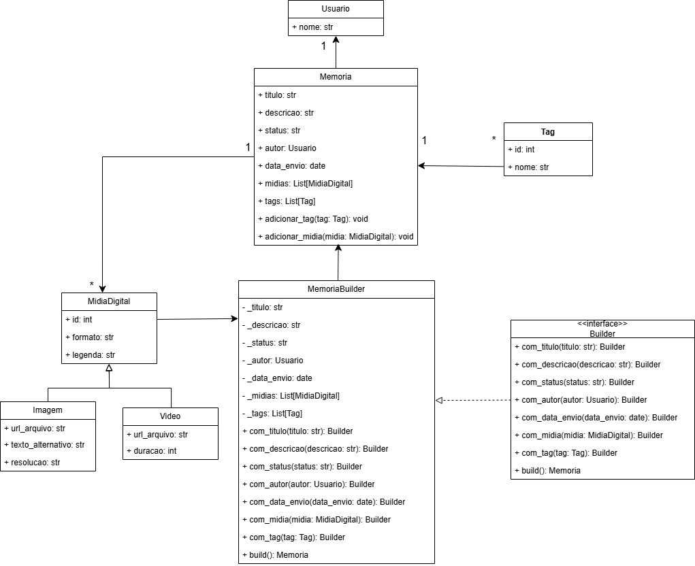

# Builder

## Introdução 

A funcionalidade de envio de memória envolve múltiplos atributos opcionais e obrigatórios, como mídias de diferentes tipos (imagem, vídeo, áudio), informações do autor, descrição, visibilidade e categorias. Diante dessa complexidade e variação de dados, o padrão Builder foi escolhido por permitir a construção flexível e controlada de objetos complexos, garantindo clareza, fluidez na leitura do código e maior robustez na validação dos dados antes da criação do objeto final.

## Metodologia e Contexto

No contexto deste artefato, foram desenvolvidas diferentes versões do padrão Builder, implementadas pelos seguintes participantes: Cairo, Gabriel e Pedro, todas baseadas no cenário de envio de memórias. Cada um criou a sua versão individual, permitindo uma análise comparativa de abordagens possíveis para o mesmo problema. Ao final do processo, as diferentes versões foram unificadas em uma versão final da modelagem. 

### Motivação da escolha

O padrão Builder foi escolhido por facilitar a construção controlada e flexível de objetos complexos, como a classe Memória, que possui diversos atributos opcionais e composições, como listas de mídias e tags. Esse padrão permite separar a lógica de criação da lógica da própria classe, evitando construtores longos e difíceis de manter. Além de tornar mais clara e legível a criação de instâncias de Memória, a abordagem também melhora a legibilidade do código, favorece a reutilização e facilita futuras extensões na estrutura da classe, como a inclusão de novos atributos ou regras de validação no processo de construção. [1]

## Versão Final

## Diagrama



## Código

```python
```

### Versões desenvolvidas individualmente

<details>
<summary>Versão do Pedro Gois:</summary>

#### Pedro
Classe MemoriaBuilder:
```python
from abc import ABC, abstractmethod
from datetime import datetime
from enum import Enum


# --- Supporting Enums and Media Classes ---

class Status(Enum):
    PENDENTE = "pendente"
    APROVADA = "aprovada"
    REJEITADA = "rejeitada"

class MidiaDigital(ABC):
    @abstractmethod
    def tipo(self):
        pass

class Imagem(MidiaDigital):
    def __init__(self, caminho_arquivo):
        self.caminho_arquivo = caminho_arquivo

    def tipo(self):
        return "Imagem"

class Video(MidiaDigital):
    def __init__(self, caminho_arquivo):
        self.caminho_arquivo = caminho_arquivo

    def tipo(self):
        return "Video"


# --- Produto Final ---

class Memoria:
    def __init__(self, descricao, midia, data_envio, status):
        self.descricao = descricao
        self.midia = midia
        self.data_envio = data_envio
        self.status = status

    def __str__(self):
        return f"Memória enviada em {self.data_envio}, status: {self.status.name}, descrição: {self.descricao}, mídia: {self.midia.tipo()}"


# --- Builder Abstrato ---

class MemoriaBuilder(ABC):
    @abstractmethod
    def setDescricao(self, descricao): pass

    @abstractmethod
    def setMidia(self, midia): pass

    @abstractmethod
    def build(self): pass


# --- Builder Concreto ---

class MemoriaPendenteBuilder(MemoriaBuilder):
    def __init__(self):
        self.descricao = None
        self.midia = None

    def setDescricao(self, descricao):
        self.descricao = descricao
        return self

    def setMidia(self, midia):
        self.midia = midia
        return self

    def build(self):
        return Memoria(
            descricao=self.descricao,
            midia=self.midia,
            data_envio=datetime.now(),
            status=Status.PENDENTE
        )


# --- Diretor (Opcional) ---

class DiretorEnvioMemoria:
    def __init__(self, builder: MemoriaBuilder):
        self.builder = builder

    def construirMemoria(self, descricao, midia):
        return self.builder.setDescricao(descricao).setMidia(midia).build()


# --- Exemplo de uso ---

# Estudante envia uma memória com imagem
builder = MemoriaPendenteBuilder()
diretor = DiretorEnvioMemoria(builder)

memoria = diretor.construirMemoria(
    descricao="Foto com amigos na faculdade",
    midia=Imagem("fotos/faculdade.jpg")
)

print(memoria)

```

</details>

<details>
<summary>Versão do Cairo Florenço:</summary>

### Cairo

### Modelagem


<center>

Autor: [Cairo Florenço](https://github.com/CA1RO)

</center>

### Codigo 

```python
from datetime import date
from typing import List


class Usuario:
    def __init__(self, nome: str):
        self.nome = nome


class Tag:
    def __init__(self, id: int, nome: str):
        self.id = id
        self.nome = nome


class MidiaDigital:
    def __init__(self, id: int, formato: str, legenda: str):
        self.id = id
        self.formato = formato
        self.legenda = legenda


class Imagem(MidiaDigital):
    def __init__(self, id: int, formato: str, legenda: str, url_arquivo: str, texto_alternativo: str, resolucao: str):
        super().__init__(id, formato, legenda)
        self.url_arquivo = url_arquivo
        self.texto_alternativo = texto_alternativo
        self.resolucao = resolucao


class Video(MidiaDigital):
    def __init__(self, id: int, formato: str, legenda: str, url_arquivo: str, duracao: int):
        super().__init__(id, formato, legenda)
        self.url_arquivo = url_arquivo
        self.duracao = duracao


class Memoria:
    def __init__(self, titulo: str, descricao: str, status: str, autor: Usuario, data_envio: date):
        self.titulo = titulo
        self.descricao = descricao
        self.status = status
        self.autor = autor
        self.data_envio = data_envio
        self.midias: List[MidiaDigital] = []
        self.tags: List[Tag] = []

    def adicionar_tag(self, tag: Tag):
        self.tags.append(tag)

    def adicionar_midia(self, midia: MidiaDigital):
        self.midias.append(midia)


class MemoriaBuilder:
    def __init__(self):
        self._titulo = None
        self._descricao = None
        self._status = None
        self._autor = None
        self._data_envio = None
        self._midias = []
        self._tags = []

    def com_titulo(self, titulo: str):
        self._titulo = titulo
        return self

    def com_descricao(self, descricao: str):
        self._descricao = descricao
        return self

    def com_status(self, status: str):
        self._status = status
        return self

    def com_autor(self, autor: Usuario):
        self._autor = autor
        return self

    def com_data_envio(self, data_envio: date):
        self._data_envio = data_envio
        return self

    def com_midia(self, midia: MidiaDigital):
        self._midias.append(midia)
        return self

    def com_tag(self, tag: Tag):
        self._tags.append(tag)
        return self

    def build(self):
        memoria = Memoria(
            titulo=self._titulo,
            descricao=self._descricao,
            status=self._status,
            autor=self._autor,
            data_envio=self._data_envio
        )
        for midia in self._midias:
            memoria.adicionar_midia(midia)
        for tag in self._tags:
            memoria.adicionar_tag(tag)
        return memoria
```

<center>

Autor: [Cairo Florenço](https://github.com/CA1RO)

</center>

</details>

<details>
<summary>Versão do Gabriel :</summary>

#### Gabriel

```python
from abc import ABC, abstractmethod
from datetime import datetime
from enum import Enum
from typing import List, Optional


# ---------------- Enums e Mídias ----------------

class StatusMemoria(Enum):
    PENDENTE = "pendente"
    ACEITA = "aceita"
    RECUSADA = "recusada"

class TipoMidia(Enum):
    IMAGEM = "imagem"
    VIDEO = "vídeo"
    AUDIO = "áudio"

class Visibilidade(Enum):
    PUBLICO = "público"
    PRIVADO = "privado"
    SOMENTE_FGA = "somente_fga"

class Midia:
    def __init__(self, tipo: TipoMidia, caminho: str):
        if not caminho.startswith("http"):
            raise ValueError("A mídia precisa ter um caminho válido (http).")
        self.tipo = tipo
        self.caminho = caminho

    def __repr__(self):
        return f"{self.tipo.value}({self.caminho})"


# ---------------- Produto Final ----------------

class Memoria:
    def __init__(
        self,
        titulo: str,
        descricao: str,
        midias: List[Midia],
        nome_autor: str,
        email_autor: str,
        data_criacao: datetime,
        status: StatusMemoria,
        visibilidade: Visibilidade,
        categorias: List[str]
    ):
        self.titulo = titulo
        self.descricao = descricao
        self.midias = midias
        self.nome_autor = nome_autor
        self.email_autor = email_autor
        self.data_criacao = data_criacao
        self.status = status
        self.visibilidade = visibilidade
        self.categorias = categorias

    def __repr__(self):
        return f"<Memoria {self.titulo!r} de {self.nome_autor}, mídias={len(self.midias)}, status={self.status.value}>"


# ---------------- Builder ----------------

class MemoriaBuilder:
    def __init__(self):
        self._titulo: Optional[str] = None
        self._descricao: Optional[str] = None
        self._midias: List[Midia] = []
        self._nome_autor: Optional[str] = None
        self._email_autor: Optional[str] = None
        self._data_criacao: datetime = datetime.utcnow()
        self._status: StatusMemoria = StatusMemoria.PENDENTE
        self._visibilidade: Visibilidade = Visibilidade.PUBLICO
        self._categorias: List[str] = []

    def com_titulo(self, titulo: str):
        self._titulo = titulo.strip()
        return self

    def com_descricao(self, descricao: str):
        self._descricao = descricao.strip()
        return self

    def adicionar_midia(self, tipo: TipoMidia, caminho: str):
        self._midias.append(Midia(tipo, caminho))
        return self

    def com_autor(self, nome: str, email: str):
        self._nome_autor = nome.strip()
        self._email_autor = email.strip()
        return self

    def com_visibilidade(self, visibilidade: Visibilidade):
        self._visibilidade = visibilidade
        return self

    def com_categorias(self, categorias: List[str]):
        self._categorias = [c.lower().strip() for c in categorias]
        return self

    def com_status_manual(self, status: StatusMemoria):
        self._status = status
        return self

    def build(self):
        if not self._titulo or not self._descricao or not self._midias:
            raise ValueError("Memória deve ter título, descrição e ao menos uma mídia.")
        return Memoria(
            titulo=self._titulo,
            descricao=self._descricao,
            midias=self._midias,
            nome_autor=self._nome_autor,
            email_autor=self._email_autor,
            data_criacao=self._data_criacao,
            status=self._status,
            visibilidade=self._visibilidade,
            categorias=self._categorias,
        )


# ---------------- Diretor ----------------

class DiretorMemoria:
    def __init__(self, builder: MemoriaBuilder):
        self._builder = builder

    def memoria_basica_com_imagem(self, titulo, descricao, autor, email, url_imagem):
        return (
            self._builder
            .com_titulo(titulo)
            .com_descricao(descricao)
            .com_autor(autor, email)
            .adicionar_midia(TipoMidia.IMAGEM, url_imagem)
            .build()
        )

```

</details>


## Referências Bibliográficas

[1] Refactoring Guru. (s.d.). *Builder*. Disponível em: https://refactoring.guru/pt-br/design-patterns/builder. Acesso em: 1 junho 2025.


## Histórico de Versão

| Versão | Data | Descrição | Autor(es) | Revisor(es) | Comentário do Revisor |
| :-: | :-: | :-: | :-: | :-: | :-: |
| 1.0 | 22/05 | Primeira versão do GoF | Pedro Gois | Pedro Gois | - |
| 1.1 | 23/05 | Adicionando a minha versão do GoF Builder | Cairo Florenço | | - |
| 1.2 | 30/05 | Atualizando a minha versão do GoF Builder | Pedro Gois | | - |
| 1.3 | 31/05 | Atualizando a minha versão do GoF Builder e adicionando introdução ao artefato| Gabriel Scheidt | | - |
| 1.4 | 01/06 | Atualizando a versão individual do Builder| Cairo Florenço | | - |