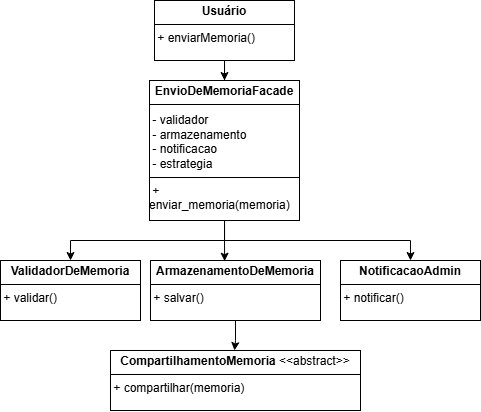
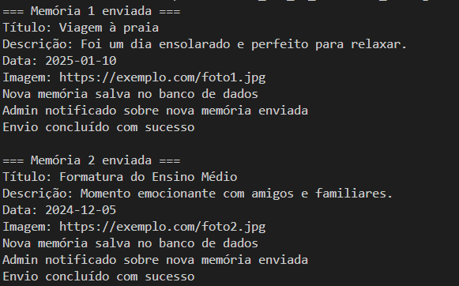

# Facade

## Introdução 

O padrão Facade tem como principal objetivo fornecer uma interface unificada para um conjunto de interfaces em um subsistema, simplificando o acesso e reduzindo o acoplamento entre os componentes internos. Ele é particularmente útil em sistemas onde múltiplas operações precisam ser executadas de forma coordenada, mas que devem ser expostas de maneira coesa e compreensível para outras partes da aplicação.

Ao final, uma versão consolidada é apresentada, reunindo os melhores elementos das contribuições anteriores, visando clareza, modularidade e aderência ao padrão. Esta versão final incorpora boas práticas de engenharia de software e exemplifica a aplicação efetiva do Facade em um sistema realista e extensível.

## Metodologia e Contexto

No contexto deste artefato, foram desenvolvidas diferentes versões do padrão Facade, implementadas pelos seguintes participantes: Cairo, Gabriel e Pedro, todas baseadas no mesmo cenário: o processo de envio de uma memória para um museu afetivo virtual. Cada um criou a sua versão individual, apresentando variações em termos de estrutura, abstração e complexidade, permitindo uma análise comparativa de abordagens possíveis para o mesmo problema. 

### Motivação da escolha

O padrão Facade foi escolhido para simplificar a interação do usuário com um conjunto complexo de funcionalidades envolvidas no envio de uma memória. Ao centralizar as responsabilidades de validação, armazenamento, notificação e compartilhamento em uma única classe (EnvioDeMemoriaFacade), o sistema se torna mais coeso e fácil de usar, reduzindo o acoplamento entre as classes e oculta a complexidade dos processos internos, facilitando a reutilização e manutenção do código. Além disso, o Facade promove uma interface única e clara para o usuário, alinhando-se à necessidade de organização e modularização demonstrada no [diagrama atualizado](/PadroesDeProjeto/3.5.1.AtualizaçãoDiagramaClasses.md).

## Versão Final

A linguagem utilizada para a implementação do Facade foi python, o o diagrama foi feito utilizando no Draw.io.

## Diagrama



## Código

```python
class Memoria:
    def __init__(self, imagem_url, titulo, descricao, data_memoria):
        self.imagem_url = imagem_url
        self.titulo = titulo
        self.descricao = descricao
        self.data_memoria = data_memoria

class ValidadorDeMemoria:
    def validar(self, memoria: Memoria):
        if not memoria.imagem_url:
            raise ValueError("Imagem obrigatória")
        if not memoria.titulo:
            raise ValueError("Título obrigatório")
        if not memoria.descricao:
            raise ValueError("Descrição obrigatória")
        if not memoria.data_memoria:
            raise ValueError("Data da memória obrigatória")


class ArmazenacaoDeMemoria:
    def salvar(self, memoria: Memoria):
        print("Nova memória salva no banco de dados")


class NotificacaoAdmin:
    def notificar(self, memoria: Memoria):
        print("Admin notificado sobre nova memória enviada")


class EnvioDeMemoriaFacade:
    def __init__(self):
        self.validador = ValidadorDeMemoria()
        self.armazenamento = ArmazenacaoDeMemoria()
        self.notificacao = NotificacaoAdmin()

    def enviar_memoria(self, memoria: Memoria):
        self.validador.validar(memoria)
        self.armazenamento.salvar(memoria)
        self.notificacao.notificar(memoria)
        print("Envio concluído com sucesso")


class Usuario:
    def compartilharMemoria(self, memoria: Memoria):
        facade = EnvioDeMemoriaFacade()
        facade.enviar_memoria(memoria)
```

### Implementação do Código



O código de implementação do padrão Facade pode ser encontrado neste [arquivo](https://github.com/UnBArqDsw2025-1-Turma02/2025.1_T02_G2_EternaFGA_Entrega03/blob/main/Projeto/GOFsEstruturais/Facade/FacadeFinal.py). Para executá-lo, navegue até o diretório onde o arquivo está localizado e utilize o seguinte comando:

```
python FacadeFinal.py
```

### Versões desenvolvidas individualmente

<details>
<summary>Versão do Pedro Gois:</summary>

#### Pedro
Interface 
```python
from abc import ABC, abstractmethod
from datetime import datetime
from enum import Enum


# -------------------------
# ENUMS E CLASSES DE SUPORTE
# -------------------------

class Status(Enum):
    PENDENTE = "pendente"
    APROVADA = "aprovada"
    REJEITADA = "rejeitada"


class MidiaDigital(ABC):
    @abstractmethod
    def tipo(self):
        pass


class Imagem(MidiaDigital):
    def __init__(self, caminho_arquivo):
        self.caminho_arquivo = caminho_arquivo

    def tipo(self):
        return "Imagem"


class Video(MidiaDigital):
    def __init__(self, caminho_arquivo):
        self.caminho_arquivo = caminho_arquivo

    def tipo(self):
        return "Video"


# -------------------------
# CLASSE PRODUTO
# -------------------------

class Memoria:
    def __init__(self, descricao, midia, data_envio, status):
        self.descricao = descricao
        self.midia = midia
        self.data_envio = data_envio
        self.status = status

    def __str__(self):
        return (f"Memória enviada em {self.data_envio.strftime('%d/%m/%Y %H:%M:%S')}, "
                f"status: {self.status.name}, descrição: {self.descricao}, "
                f"mídia: {self.midia.tipo()}")


# -------------------------
# PADRÃO BUILDER
# -------------------------

class MemoriaBuilder(ABC):
    @abstractmethod
    def setDescricao(self, descricao): pass

    @abstractmethod
    def setMidia(self, midia): pass

    @abstractmethod
    def build(self): pass


class MemoriaPendenteBuilder(MemoriaBuilder):
    def __init__(self):
        self.descricao = None
        self.midia = None

    def setDescricao(self, descricao):
        self.descricao = descricao
        return self

    def setMidia(self, midia):
        self.midia = midia
        return self

    def build(self):
        return Memoria(
            descricao=self.descricao,
            midia=self.midia,
            data_envio=datetime.now(),
            status=Status.PENDENTE
        )


class DiretorEnvioMemoria:
    def __init__(self, builder: MemoriaBuilder):
        self.builder = builder

    def construirMemoria(self, descricao, midia):
        return self.builder.setDescricao(descricao).setMidia(midia).build()


# -------------------------
# CLASSES DE USUÁRIO
# -------------------------

class Estudante:
    def __init__(self, nome):
        self.nome = nome
        self.minhas_memorias = []

    def adicionar_memoria(self, memoria):
        self.minhas_memorias.append(memoria)


class Administrador:
    def aprovar(self, memoria):
        memoria.status = Status.APROVADA
        print("✔ Memória aprovada.")

    def rejeitar(self, memoria):
        memoria.status = Status.REJEITADA
        print("✖ Memória rejeitada.")


# -------------------------
# PADRÃO FACADE
# -------------------------

class FachadaMemoria:
    def __init__(self, administrador: Administrador):
        self.administrador = administrador

    def enviar_memoria(self, estudante: Estudante, descricao: str, midia: MidiaDigital):
        """
        Estudante envia uma memória com status pendente.
        """
        builder = MemoriaPendenteBuilder()
        diretor = DiretorEnvioMemoria(builder)
        memoria = diretor.construirMemoria(descricao, midia)

        estudante.adicionar_memoria(memoria)
        print("📨 Memória enviada com sucesso! Aguardando aprovação.")
        return memoria

    def aprovar_memoria(self, memoria: Memoria):
        self.administrador.aprovar(memoria)

    def rejeitar_memoria(self, memoria: Memoria):
        self.administrador.rejeitar(memoria)


# -------------------------
# EXEMPLO DE USO
# -------------------------

if __name__ == "__main__":
    admin = Administrador()
    estudante = Estudante("João da Silva")

    fachada = FachadaMemoria(admin)

    # Envio de memória
    memoria = fachada.enviar_memoria(
        estudante,
        descricao="Foto com amigos na faculdade",
        midia=Imagem("fotos/formatura.jpg")
    )

    print(memoria)

    # Aprovação da memória
    fachada.aprovar_memoria(memoria)
    print(memoria)
```

</details>

<details>
<summary>Versão do Cairo Florenço:</summary>

### Cairo

### Modelagem


<center>

Autor: [Cairo Florenço](https://github.com/CA1RO)

</center>

### Código

```python
class Memoria:
    def __init__(self, imagem_url, titulo, descricao, data_memoria):
        self.imagem_url = imagem_url
        self.titulo = titulo
        self.descricao = descricao
        self.data_memoria = data_memoria

class ValidadorDeMemoria:
    def validar(self, memoria: Memoria):
        if not memoria.imagem_url:
            raise ValueError("Imagem obrigatória")
        if not memoria.titulo:
            raise ValueError("Título obrigatório")
        if not memoria.descricao:
            raise ValueError("Descrição obrigatória")
        if not memoria.data_memoria:
            raise ValueError("Data da memória obrigatória")


class ArmazenacaoDeMemoria:
    def salvar(self, memoria: Memoria):
        print("Nova memória salva no banco de dados")


class NotificacaoAdmin:
    def notificar(self, memoria: Memoria):
        print("Admin notificado sobre nova memória enviada")


class EnvioDeMemoriaFacade:
    def __init__(self):
        self.validador = ValidadorDeMemoria()
        self.armazenamento = ArmazenacaoDeMemoria()
        self.notificacao = NotificacaoAdmin()

    def enviar_memoria(self, memoria: Memoria):
        self.validador.validar(memoria)
        self.armazenamento.salvar(memoria)
        self.notificacao.notificar(memoria)
        print("Envio concluído com sucesso")


class Usuario:
    def compartilharMemoria(self, memoria: Memoria):
        facade = EnvioDeMemoriaFacade()
        facade.enviar_memoria(memoria)
```

<center>

Autor: [Cairo Florenço](https://github.com/CA1RO)

</center>

</details>

<details>
<summary>Versão do Gabriel Scheidt:</summary>

#### Gabriel Scheidt

```python
from datetime import datetime
from typing import List, Tuple
from memoria_builder import (
    MemoriaBuilder,
    Memoria,
    TipoMidia,
    Visibilidade,
    StatusMemoria,
)


# ---------------- Subsistemas ----------------

class ValidadorDeMemoria:
    def validar(self, memoria: Memoria):
        if not memoria.titulo:
            raise ValueError("Título obrigatório.")
        if not memoria.descricao:
            raise ValueError("Descrição obrigatória.")
        if not memoria.midias or len(memoria.midias) == 0:
            raise ValueError("Deve conter pelo menos uma mídia.")
        if not memoria.nome_autor or not memoria.email_autor:
            raise ValueError("Autor e email obrigatórios.")
        if not isinstance(memoria.visibilidade, Visibilidade):
            raise ValueError("Visibilidade inválida.")
        if not isinstance(memoria.status, StatusMemoria):
            raise ValueError("Status inválido.")
        print("[Validador] Memória validada com sucesso.")

class RepositorioDeMemorias:
    def salvar(self, memoria: Memoria):
        print(f"[DB] Memória '{memoria.titulo}' de {memoria.nome_autor} salva no banco de dados.")

class NotificacaoAdministrativa:
    def enviar_alerta(self, memoria: Memoria):
        print(f"[Notificação] Admin notificado sobre a nova memória: '{memoria.titulo}'.")

class LoggerDeEnvio:
    def registrar(self, memoria: Memoria):
        print(f"[Log] Enviada em: {memoria.data_criacao.isoformat()} | Autor: {memoria.nome_autor}")


# ---------------- Facade ----------------

class EnvioMemoriaFacade:
    def __init__(self):
        self.validador = ValidadorDeMemoria()
        self.repositorio = RepositorioDeMemorias()
        self.notificador = NotificacaoAdministrativa()
        self.logger = LoggerDeEnvio()

    def enviar_memoria(
        self,
        titulo: str,
        descricao: str,
        midias: List[Tuple[TipoMidia, str]],
        nome_autor: str,
        email_autor: str,
        categorias: List[str],
        visibilidade: Visibilidade = Visibilidade.PUBLICO,
        status: StatusMemoria = StatusMemoria.PENDENTE
    ) -> Memoria:
        builder = MemoriaBuilder()
        builder.com_titulo(titulo)\
               .com_descricao(descricao)\
               .com_autor(nome_autor, email_autor)\
               .com_visibilidade(visibilidade)\
               .com_status_manual(status)\
               .com_categorias(categorias)

        for tipo, caminho in midias:
            builder.adicionar_midia(tipo, caminho)

        memoria = builder.build()

        self.validador.validar(memoria)
        self.repositorio.salvar(memoria)
        self.notificador.enviar_alerta(memoria)
        self.logger.registrar(memoria)

        print("[Facade] Envio da memória concluído com sucesso.")
        return memoria
```
</details>


## Histórico de Versão

| Versão | Data | Descrição | Autor(es) | Revisor(es) | Comentário do Revisor |
| :-: | :-: | :-: | :-: | :-: | :-: |
| 1.0 | 22/05 | Primeira versão do GoF | Pedro Gois | Pedro Gois | - |
| 1.1 | 23/05 | Adicionando minha versão de GoF Estrutural Facade | Cairo Florenço | | - |
| 1.2 | 30/05 | Atualizando minha versão de GoF Estrutural Facade | Pedro Gois | | - |
| 1.3 | 31/05 | Atualizando minha versão de GoF Estrutural Facade e adicionando a introdução | Gabriel Scheidt | Cairo Florenço | tudo ok. |
| 1.4 | 01/06 | Atualizando versão individual de GoF Facade | Cairo | | - |
| 1.5 | 01/06 | Adicionando a motivação, metodologia e outras explicações sobre o GoF Facade | Cairo | | - |
| 2.0 | 01/06 | Adicionando versão final do Facade | Cairo Florenço| | - |
| 2.1 | 02/06 | Adicionando a parte de implementação do código | Cairo Florenço | | - |