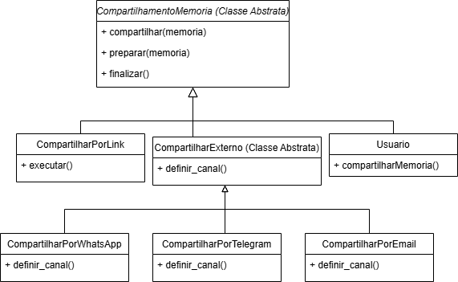

# Template Method

## Introdução 

Na aplicação A Eterna FGA, o padrão Template Method foi utilizado para estruturar o processo de compartilhamento de memórias em diferentes canais, como e-mail institucional, Telegram ou QR Code. O processo de compartilhamento envolve etapas comuns, como verificação de permissão, geração de link e registro de log, mas varia na forma como a mensagem é formatada e enviada, o que o torna ideal para o uso do Template Method.

Este artefato inclui diferentes implementações do padrão, cada uma responsável por um canal de compartilhamento distinto. Ao final, é apresentada uma versão consolidada que reúne as boas práticas observadas, com foco em clareza, reutilização de código e fácil extensão para novos formatos de compartilhamento.

## Metodologia

Para o desenvolvimento do Template Method, foram desenvolvidas diferentes versões individuais, implementadas pelos seguintes participantes: Cairo, Gabriel e Pedro, todas baseadas no mesmo cenário: compartilhamentos de memória. Cada um criou a sua versão individual, apresentando variações em termos de estrutura, abstração e complexidade, permitindo uma análise comparativa de abordagens possíveis para o mesmo problema. Ao final do processo, as diferentes versões foram unificadas em uma versão final da modelagem. 

### Motivação da escolha

O padrão Template Method foi escolhido por permitir definir a estrutura de um algoritmo na superclasse, deixando que as subclasses implementem etapas específicas. Isso garante consistência no processo geral e flexibilidade para adaptar partes do comportamento. Com essas considerações, ele foi aplicado para organizar o fluxo de compartilhamento de memórias do Eterna FGA, permitindo que diferentes formas de envio sigam um padrão comum, mas com comportamentos específicos. Essa aplicação do padrão facilita a adição de novos meios de compartilhamento e melhora a manutenção do código.

## Versão Final

A linguagem utilizada para a implementação do Template Method foi python, o o diagrama foi feito utilizando no Draw.io.

## Diagrama



## Código

```python
from abc import ABC, abstractmethod

class CompartilhamentoMemoria(ABC):
    def compartilhar(self, memoria):
        self.preparar(memoria)
        self.executar(memoria)
        self.finalizar()

    def preparar(self, memoria):
        print(f"[Preparar] Iniciando compartilhamento da memória: {memoria['titulo']}")

    @abstractmethod
    def executar(self, memoria):
        pass

    def finalizar(self):
        print("[Finalizar] Compartilhamento concluído.\n")


class CompartilharPorLink(CompartilhamentoMemoria):
    def executar(self, memoria):
        link = f"https://meusite.com/memoria/{memoria['id']}"
        print(f"[Link Copiado] Link: {link}")


class CompartilharExterno(CompartilhamentoMemoria, ABC):
    def executar(self, memoria):
        canal = self.definir_canal()
        link = f"https://meusite.com/memoria/{memoria['id']}"
        print(f"[{canal}] Enviando link: {link}")

    @abstractmethod
    def definir_canal(self):
        pass

class CompartilharPorWhatsApp(CompartilharExterno):
    def definir_canal(self):
        return "WhatsApp"


class CompartilharPorTelegram(CompartilharExterno):
    def definir_canal(self):
        return "Telegram"


class CompartilharPorEmail(CompartilharExterno):
    def definir_canal(self):
        return "Email"


class Usuario:
    def __init__(self, nome):
        self.nome = nome

    def compartilharMemoria(self, memoria, estrategia: CompartilhamentoMemoria):
        print(f"Usuário {self.nome} está compartilhando uma memória...")
        estrategia.compartilhar(memoria)


```

### Versões desenvolvidas individualmente

<details>
<summary>Versão do Pedro Gois:</summary>

#### Pedro
Method
```python
from abc import ABC, abstractmethod
from datetime import datetime
from enum import Enum


# -------------------------
# ENUM E CLASSES DE SUPORTE
# -------------------------

class Status(Enum):
    PENDENTE = "pendente"
    APROVADA = "aprovada"
    REJEITADA = "rejeitada"


class MidiaDigital(ABC):
    @abstractmethod
    def tipo(self):
        pass


class Imagem(MidiaDigital):
    def __init__(self, caminho_arquivo):
        self.caminho_arquivo = caminho_arquivo

    def tipo(self):
        return "Imagem"


# -------------------------
# CLASSE DE MEMÓRIA
# -------------------------

class Memoria:
    def __init__(self, descricao, midia, data_envio, status):
        self.descricao = descricao
        self.midia = midia
        self.data_envio = data_envio
        self.status = status

    def __str__(self):
        return (f"Memória enviada em {self.data_envio.strftime('%d/%m/%Y %H:%M:%S')}, "
                f"status: {self.status.name}, descrição: {self.descricao}, "
                f"mídia: {self.midia.tipo()}")


# -------------------------
# TEMPLATE METHOD: Compartilhador
# -------------------------

class CompartilhadorMemoria(ABC):
    def compartilhar(self, memoria: Memoria):
        self.validar_memoria(memoria)
        url = self.gerar_url(memoria)
        return self.formatar_link(url)

    def validar_memoria(self, memoria):
        if memoria.status != Status.APROVADA:
            raise ValueError("⚠️ Só é possível compartilhar memórias que foram aprovadas.")

    def gerar_url(self, memoria):
        # Em um sistema real, você teria uma URL com slug ou ID real.
        return f"https://meusite.com/memorias/{id(memoria)}"

    @abstractmethod
    def formatar_link(self, url: str):
        pass


# -------------------------
# IMPLEMENTAÇÕES CONCRETAS
# -------------------------

class CompartilhadorWhatsApp(CompartilhadorMemoria):
    def formatar_link(self, url):
        texto = f"Veja essa memória incrível: {url}"
        return f"https://wa.me/?text={texto.replace(' ', '%20')}"


class CompartilhadorEmail(CompartilhadorMemoria):
    def formatar_link(self, url):
        assunto = "Memória Compartilhada"
        corpo = f"Veja essa memória: {url}"
        return f"mailto:?subject={assunto.replace(' ', '%20')}&body={corpo.replace(' ', '%20')}"


class CompartilhadorLinkDireto(CompartilhadorMemoria):
    def formatar_link(self, url):
        return url


# -------------------------
# USO DO TEMPLATE METHOD
# -------------------------

if __name__ == "__main__":
    # Criação de uma memória aprovada
    memoria = Memoria(
        descricao="Foto da formatura com os amigos",
        midia=Imagem("formatura.jpg"),
        data_envio=datetime.now(),
        status=Status.APROVADA
    )

    # Lista de canais de compartilhamento
    compartilhadores = [
        CompartilhadorWhatsApp(),
        CompartilhadorEmail(),
        CompartilhadorLinkDireto()
    ]

    print(f"\n🎓 Compartilhando: {memoria.descricao}\n")

    for compartilhador in compartilhadores:
        nome_canal = compartilhador.__class__.__name__.replace("Compartilhador", "")
        link = compartilhador.compartilhar(memoria)
        print(f"{nome_canal}: {link}")
```

</details>

<details>
<summary>Versão do Cairo Florenço:</summary>

### Cairo

### Modelagem


<center>

Autor: [Cairo Florenço](https://github.com/CA1RO)

</center>

### Código

```python
from abc import ABC, abstractmethod

class CompartilhamentoMemoria(ABC):
    def compartilhar(self, memoria):
        self.preparar(memoria)
        self.executar(memoria)
        self.finalizar()

    def preparar(self, memoria):
        print(f"[Preparar] Iniciando compartilhamento da memória: {memoria['titulo']}")

    @abstractmethod
    def executar(self, memoria):
        pass

    def finalizar(self):
        print("[Finalizar] Compartilhamento concluído.\n")


class CompartilharPorLink(CompartilhamentoMemoria):
    def executar(self, memoria):
        link = f"https://meusite.com/memoria/{memoria['id']}"
        print(f"[Link Copiado] Link: {link}")


class CompartilharExterno(CompartilhamentoMemoria, ABC):
    def executar(self, memoria):
        canal = self.definir_canal()
        link = f"https://meusite.com/memoria/{memoria['id']}"
        print(f"[{canal}] Enviando link: {link}")

    @abstractmethod
    def definir_canal(self):
        pass

class CompartilharPorWhatsApp(CompartilharExterno):
    def definir_canal(self):
        return "WhatsApp"


class CompartilharPorTelegram(CompartilharExterno):
    def definir_canal(self):
        return "Telegram"


class CompartilharPorEmail(CompartilharExterno):
    def definir_canal(self):
        return "Email"


class Usuario:
    def __init__(self, nome):
        self.nome = nome

    def compartilharMemoria(self, memoria, estrategia: CompartilhamentoMemoria):
        print(f"Usuário {self.nome} está compartilhando uma memória...")
        estrategia.compartilhar(memoria)


```
<center>

Autor: [Cairo Florenço](https://github.com/CA1RO)

</center>

</details>

<details>
<summary>Versão do Gabriel:</summary>

```python
from abc import ABC, abstractmethod
from datetime import datetime
from enum import Enum
from typing import List


# ------------------------
# ENUMS E CLASSES DE SUPORTE
# ------------------------

class StatusMemoria(Enum):
    PENDENTE = "pendente"
    ACEITA = "aceita"
    RECUSADA = "recusada"

class Midia:
    def __init__(self, tipo: str, caminho: str):
        self.tipo = tipo
        self.caminho = caminho

class Memoria:
    def __init__(
        self,
        titulo: str,
        midias: List[Midia],
        descricao: str,
        autor: str,
        status: StatusMemoria,
        data_envio: datetime,
    ):
        self.titulo = titulo
        self.midias = midias
        self.descricao = descricao
        self.autor = autor
        self.status = status
        self.data_envio = data_envio


# ------------------------
# TEMPLATE METHOD
# ------------------------

class CompartilhamentoMemoria(ABC):
    def compartilhar(self, memoria: Memoria) -> str:
        if memoria.status != StatusMemoria.ACEITA:
            raise PermissionError("⚠️ Apenas memórias aceitas podem ser compartilhadas.")
        print(f"[LOG] {memoria.autor} tentou compartilhar em {datetime.utcnow().isoformat()}")
        url = f"https://eternafga.unb.br/memoria/{memoria.titulo.lower().replace(' ', '-')}-{id(memoria)}"
        return self.encaminhar(memoria, self.formatar_mensagem(memoria, url))

    @abstractmethod
    def formatar_mensagem(self, memoria: Memoria, url: str) -> str:
        pass

    @abstractmethod
    def encaminhar(self, memoria: Memoria, mensagem: str) -> str:
        pass


# ------------------------
# IMPLEMENTAÇÕES CONCRETAS
# ------------------------

class CompartilhadorEmailFGA(CompartilhamentoMemoria):
    def formatar_mensagem(self, memoria, url):
        return f"{memoria.autor} compartilhou uma memória:\n{memoria.titulo}\n{memoria.descricao}\n{url}"

    def encaminhar(self, memoria, mensagem):
        return f"📧 Enviado via email institucional:\n{mensagem}"

class CompartilhadorTelegram(CompartilhamentoMemoria):
    def formatar_mensagem(self, memoria, url):
        return f"📨 Telegram: {memoria.titulo}\n{url}"

    def encaminhar(self, memoria, mensagem):
        return f"📨 Telegram enviado: {mensagem}"

class CompartilhadorQRCode(CompartilhamentoMemoria):
    def formatar_mensagem(self, memoria, url):
        return f"{url} (QR gerado)"

    def encaminhar(self, memoria, mensagem):
        return f"[QR] Código gerado: {mensagem}"


# ------------------------
# EXEMPLO DE USO
# ------------------------

if __name__ == "__main__":
    memoria = Memoria(
        titulo="Apresentação Final de Projeto",
        midias=[Midia("imagem", "http://site/imgs/projeto.png")],
        descricao="Uma jornada desafiadora e gratificante.",
        autor="Marina Lima",
        status=StatusMemoria.ACEITA,
        data_envio=datetime.now()
    )

    compartilhadores = [
        CompartilhadorEmailFGA(),
        CompartilhadorTelegram(),
        CompartilhadorQRCode()
    ]

    print(f"\n📤 Compartilhando: {memoria.titulo}\n")

    for c in compartilhadores:
        nome = c.__class__.__name__.replace("Compartilhador", "")
        try:
            print(f"{nome}: {c.compartilhar(memoria)}")
        except Exception as e:
            print(f"{nome}: ERRO - {e}")

```

</details>


## Histórico de Versão

| Versão | Data | Descrição | Autor(es) | Revisor(es) | Comentário do Revisor |
| :-: | :-: | :-: | :-: | :-: | :-: |
| 1.0 | 22/05 | Primeira versão do GoF | Pedro Gois | Pedro Gois | - |
| 1.1 | 30/05 | segunda versão do GoF | Pedro Gois | Pedro Gois | - |
| 1.2 | 30/05 | Primeira versão do GoF e adição da introdução ao artefato | Gabriel Scheidt | Cairo Florenço | Tudo ok. |
| 1.3 | 01/06 | Primeira versão do GoF individual | Cairo Florenço | - | - |
| 1.4 | 01/06 | Adiciona documentação do Template Method | Cairo Florenço | - | - |
