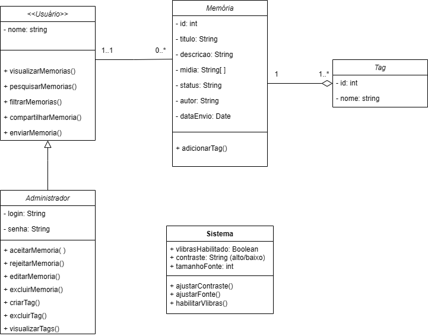

# Evolução do Diagrama de Classes: Do Antigo ao Novo

- O diagrama de classes foi contruído usando a ferramenta [draw.io](https://app.diagrams.net/) e a construção foi feita em equipe durante uma reunião gravada, presente em [Ata 23/05](/AtasDeReunião/reuniao2305.md).

O novo diagrama de classes representa um avanço importante em relação à versão anterior. Ele está mais completo e organizado. A seguir, destacamos as principais melhorias:

## Diagrama de Classes - Entrega 2

### Diagrama de Classes - Entrega 3

<iframe frameborder="0" style="width:100%;height:1314px;" src="https://viewer.diagrams.net/?tags=%7B%7D&lightbox=1&highlight=0000ff&edit=_blank&layers=1&nav=1&title=Diagrama_Classes.drawio&dark=0#Uhttps%3A%2F%2Fdrive.google.com%2Fuc%3Fid%3D1ANLGoMSh-q9ZrjE9yx2yXLP4Js2I2G6r%26export%3Ddownload"></iframe>

## 1. Estrutura de Usuários Mais Clara e Especializada

**Antes:** Havia uma classe abstrata `<<Usuário>>` com nome e alguns métodos genéricos, da qual `Administrador` herdava, adicionando login e senha.

**Agora:** A classe `<<Usuário>>` traz atributos comuns (login, senha, nome, tipo), e dela derivam duas classes concretas: `Estudante` e `Administrador`. O `Estudante` tem métodos próprios para suas ações, enquanto o `Administrador` continua cuidando da gestão, mas com funções mais bem definidas. Foi criado a classe `Visitante` para usuários externos, sem a necessidade de autenticação. 

**Por que isso é melhor?**
Fica mais fácil separar responsabilidades e controlar o que cada tipo de usuário pode fazer. Além disso, evita duplicação de código e melhora a organização.

---

## 2. Inclusão de Conceitos-Chave: Coleção e Exposição

**Antes:** Não havia uma forma clara de agrupar memórias ou exibi-las formalmente.

**Agora:** Foram criadas as classes `Colecao` (com nome, descrição, autor) e `Exposicao` (com título, descrição, datas e curador). Cada exposição agrupa coleções, e cada coleção agrupa memórias.

**Por que isso é melhor?**
O sistema agora permite organizar e apresentar conteúdos de forma mais rica e profissional, dando sentido às memórias cadastradas.

---

## 3. Modelagem Mais Precisa da Memória

**Antes:** A classe `Memoria` usava um array genérico de strings para mídias, e os campos como autor e status eram simples textos.

**Agora:**

* Foi criada uma hierarquia `MídiaDigital` com subclasses como `Imagem` e `Vídeo`, cada uma com atributos específicos.
* O campo `autor` agora é do tipo `Usuario`, e o `status` é uma classe própria (`Status`) com observação e aprovação.

**Por que isso é melhor?**
Agora é possível tratar diferentes tipos de mídia de forma adequada. A gestão do status ficou mais estruturada, e as tags podem ser reaproveitadas, facilitando a busca e organização.

---

## 4. Separação da Lógica de Autenticação

**Antes:** A autenticação estava espalhada ou embutida em classes como `Administrador`.

**Agora:** Existe uma classe `Autenticador`, com métodos específicos como `autenticarLogin` e `verificarCredenciais`.

**Por que isso é melhor?**
A lógica fica centralizada e mais fácil de manter, seguindo o princípio de responsabilidade única.

---

## Conclusão

O novo diagrama é mais detalhado, organizado e pronto para crescer. Ele reflete melhor as necessidades do sistema, melhora a separação de responsabilidades e abre caminho para soluções mais escaláveis e bem estruturadas. Esse refinamento certamente vai facilitar o desenvolvimento e a manutenção do projeto daqui pra frente, facilitando o trabalho para a entrega 3.

