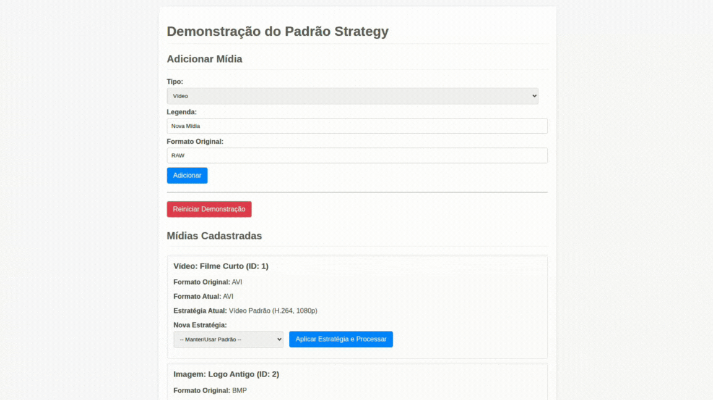
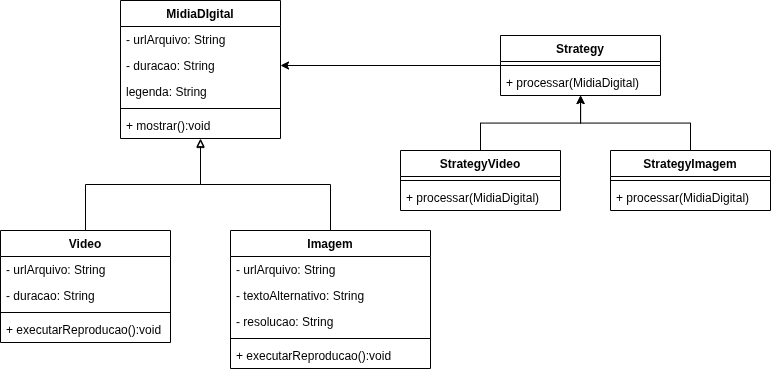
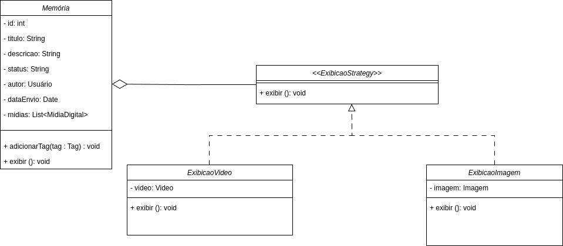
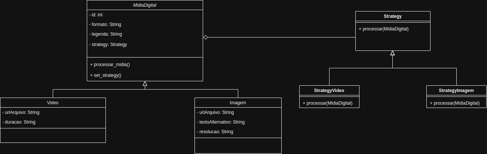

# Strategy

## Introdução

O Strategy permite definir uma família de algoritmos, encapsulá-los e torná-los intercambiáveis. Esse padrão permite que o algoritmo varie independentemente dos clientes que o utilizam. Em outras palavras, o Strategy promove a separação entre a lógica de execução de uma tarefa e as diferentes maneiras de realizá-la, favorecendo a flexibilidade, reutilização e manutenção do código [1].

## Elementos principais do Strategy [2]

- **Context (Contexto):** Mantém uma referência para um objeto Strategy e interage com ele exclusivamente através da interface Strategy.

- **Strategy (Estratégia):** Interface comum para todas as implementações de algoritmo suportadas.

- **ConcreteStrategy (Estratégias Concretas):** Implementações específicas do algoritmo, que seguem a interface Strategy.

## Metodologia

A equipe foi dividida entre os integrantes [Marcos](https://github.com/devMarcosVM), [Manuella](https://github.com/manuvaladares), [William](https://github.com/willxbernardo) e [Mateus](https://github.com/Mateushqms). Cada membro ficou responsável por estudar o padrão Strategy individualmente e aplicar o conceito em uma implementação prática. Após o desenvolvimento individual, realizamos uma reunião para apresentar e discutir cada versão, comparando as abordagens adotadas.

Decidimos em [reunião](../../AtasDeReunião/reuniao2305.md) aprofundar nossos estudos no Gof Comportamental **Strategy**, e logo optamos por aplicar o padrão na classe **MídiaDigital**.

Com base nessa discussão, decidimos unificar as melhores ideias e elaborar uma solução conjunta, aplicando o padrão Strategy em um cenário realista dentro da aplicação Eterna FGA. Essa integração buscou respeitar a essência do padrão e refletir sua aplicação prática.

### Contexto

Na aplicação Eterna FGA, o padrão Strategy foi empregado para permitir diferentes estratégias de renderização de mídias digitais. O sistema exige que os usuários possam visualizar as mídias apresentadas de maneiras distintas — por exemplo, com qualidade superior ou adequada.

Ao adotar o Strategy, essas diferentes estratégias foram encapsuladas e atribuídas dinamicamente conforme a escolha do usuário, sem alterar a estrutura geral da aplicação.

### Motivação da escolha

O Strategy foi escolhido por permitir que diferentes comportamentos (neste caso, algoritmos de ordenação) sejam definidos de maneira modular, limpa e intercambiável. A adoção desse padrão evita a utilização de estruturas condicionais complexas (como if ou switch) para selecionar o tipo de ordenação, promovendo uma arquitetura mais flexível, expansível e de fácil manutenção.

## Versão Final

Após as discussões em grupo e a consolidação das ideias ([reunião correspondente](../../AtasDeReunião/reuniao3005.md)), foi desenvolvida uma interface web funcional com backend em Python. A interface permite ao usuário escolher entre diferentes formas de exibição das mídias digitais, como por ordem cronológica, por tipo ou por popularidade.

Cada uma dessas opções utiliza uma estratégia distinta de ordenação, implementada separadamente e injetada no contexto da aplicação. Essa abordagem garantiu um código limpo, desacoplado e de fácil extensão — por exemplo, para introduzir novas estratégias no futuro, basta criar uma nova classe concreta.

## Diagrama

<iframe frameborder="0" style="width:100%;height:397px;" src="https://viewer.diagrams.net/?tags=%7B%7D&lightbox=1&highlight=0000ff&edit=_blank&layers=1&nav=1&title=Strategy.drawio&dark=0#Uhttps%3A%2F%2Fdrive.google.com%2Fuc%3Fid%3D1jygnx33WLBnMbBhBtKDy_sv1K67I41xs%26export%3Ddownload"></iframe>

## Interface



**o executável está licalizado dentro da pasta projetos, no arquivo app.py veja como executar em [Como executar](../../../Projeto/README.md)**

``` bash
.
├── .github/
├── docs/
├── Projeto/
│   ├── GOFsComportamentais/
│   │   └── Strategy/  <--------
│   ├── GOFsCriacionais/
│   │   └── FactoryMethod/
│   ├── GOFsEstruturais/
│   │   └── Composite/
│   └── README.md
├── CODE_OF_CONDUCT.md
├── CONTRIBUTING.md
└── README.md

``` 


## Código

```
# ===== STRATEGY INTERFACE (Processamento) =====
class ProcessamentoStrategy(ABC):
    @abstractmethod
    def processar(self) -> List[str]: # Modificado para retornar logs
        pass
    @abstractmethod
    def obter_formato(self) -> str:
        pass
    @abstractmethod
    def validar(self) -> bool:
        pass
    def __str__(self) -> str: # Adicionado para melhor display na UI
        return self.__class__.__name__

# ===== CONCRETE STRATEGIES (Processamento) =====
class ProcessamentoVideo(ProcessamentoStrategy):
    def __init__(self, codec: str, qualidade: int):
        self.codec = codec
        self.qualidade = qualidade
    def processar(self) -> List[str]:
        return [
            f"🎬 Processando vídeo com codec {self.codec}",
            f"📺 Aplicando qualidade: {self.qualidade}p",
            "🖼️  Gerando thumbnail...",
            "🌐 Otimizando para streaming...",
            "✅ Processamento de vídeo concluído!"
        ]
    def obter_formato(self) -> str:
        return f"MP4 - {self.codec} ({self.qualidade}p)"
    def validar(self) -> bool:
        return self.codec is not None and self.qualidade > 0
    def __str__(self) -> str:
        return f"Vídeo Padrão ({self.codec}, {self.qualidade}p)"

class ProcessamentoImagem(ProcessamentoStrategy):
    def __init__(self, compressao: str, resolucao: str):
        self.compressao = compressao
        self.resolucao = resolucao
    def processar(self) -> List[str]:
        return [
            f"🖼️  Processando imagem com compressão {self.compressao}",
            f"📏 Ajustando resolução para: {self.resolucao}",
            "🗜️  Otimizando tamanho do arquivo...",
            "📱 Gerando versões responsivas...",
            "✅ Processamento de imagem concluído!"
        ]
    def obter_formato(self) -> str:
        return f"JPEG - {self.compressao} ({self.resolucao})"
    def validar(self) -> bool:
        return self.compressao is not None and self.resolucao is not None
    def __str__(self) -> str:
        return f"Imagem Padrão ({self.compressao}, {self.resolucao})"

class ProcessamentoWebOptimizado(ProcessamentoStrategy):
    def __init__(self, formato_web: str = "WebP"):
        self.formato_web = formato_web
    def processar(self) -> List[str]:
        return [
            f"🌐 Otimizando para web em formato {self.formato_web}...",
            "⚡ Reduzindo tamanho do arquivo...",
            "🔄 Aplicando lazy loading...",
            "📊 Gerando diferentes resoluções...",
            "✅ Otimização web concluída!"
        ]
    def obter_formato(self) -> str:
        return f"{self.formato_web} Otimizado para Web"
    def validar(self) -> bool:
        return self.formato_web is not None
    def __str__(self) -> str:
        return f"Otimização Web ({self.formato_web})"

class ProcessamentoMobileOptimizado(ProcessamentoStrategy):
    def processar(self) -> List[str]:
        return [
            "📱 Otimizando para dispositivos móveis...",
            "🔋 Reduzindo consumo de bateria...",
            "📶 Otimizando para conexões lentas...",
            "✅ Otimização mobile concluída!"
        ]
    def obter_formato(self) -> str:
        return "Mobile Optimized"
    def validar(self) -> bool:
        return True
    def __str__(self) -> str:
        return "Otimização Mobile"

# ===== CONTEXT CLASS (MidiaDigital) =====
class MidiaDigital(ABC):
    def __init__(self, id_midia: int, formato_original: str, legenda: str):
        self.id = id_midia
        self.formato_original = formato_original # Guardar o original
        self.formato_atual = formato_original # Começa com o original
        self.legenda = legenda
        self.data_criacao = datetime.now()
        self._strategy: Optional[ProcessamentoStrategy] = None
        self.logs_processamento: List[str] = []

    def set_strategy(self, strategy: ProcessamentoStrategy) -> None:
        self._strategy = strategy

    def executar_processamento(self) -> None:
        self.logs_processamento = [] # Limpa logs anteriores desta mídia
        if self._strategy and self._strategy.validar():
            self.logs_processamento.append(f"🚀 Iniciando processamento da mídia ID: {self.id} ('{self.legenda}')")
            self.logs_processamento.append(f"🎞️ Formato antes: {self.formato_atual}")
            self.logs_processamento.append(f"🛠️ Usando estratégia: {self._strategy}")
            self.logs_processamento.append("-" * 30)
            
            msgs_strategy = self._strategy.processar()
            self.logs_processamento.extend(msgs_strategy)
            self.formato_atual = self._strategy.obter_formato()
            
            self.logs_processamento.append("-" * 30)
            self.logs_processamento.append("✅ Processamento concluído!")
            self.logs_processamento.append(f"📄 Novo formato: {self.formato_atual}")
        else:
            msg = f"❌ Estratégia inválida ou não definida para mídia ID: {self.id}"
            self.logs_processamento.append(msg)

    @property
    def strategy(self) -> Optional[ProcessamentoStrategy]:
        return self._strategy
    
    def __str__(self) -> str:
        return f"ID:{self.id} ({self.legenda}) - Formato: {self.formato_atual}"
    
    @abstractmethod
    def tipo(self) -> str: # Para diferenciar na UI
        pass

# ===== CONCRETE CONTEXTS (Midia) =====
class Video(MidiaDigital):
    def __init__(self, id_midia: int, formato: str, legenda: str, url_arquivo: str, duracao: int):
        super().__init__(id_midia, formato, legenda)
        self.url_arquivo = url_arquivo
        self.duracao = duracao
        self.set_strategy(ProcessamentoVideo("H.264", 1080)) # Estratégia padrão
    
    def tipo(self) -> str: return "Vídeo"

class Imagem(MidiaDigital):
    def __init__(self, id_midia: int, formato: str, legenda: str, url_arquivo: str, resolucao: str):
        super().__init__(id_midia, formato, legenda)
        self.url_arquivo = url_arquivo
        self.resolucao_original = resolucao # Guardar original
        self.set_strategy(ProcessamentoImagem("Alta", "1920x1080")) # Estratégia padrão

    def tipo(self) -> str: return "Imagem"


# ===== MEMORIA CLASS (Simplificada para o backend) =====
class Memoria:
    def __init__(self):
        self._midias: List[MidiaDigital] = []
    
    def adicionar_midia(self, midia: MidiaDigital) -> None:
        self._midias.append(midia)
    
    def get_midia_by_id(self, midia_id: int) -> Optional[MidiaDigital]:
        for midia in self._midias:
            if midia.id == midia_id:
                return midia
        return None

    @property
    def midias(self) -> List[MidiaDigital]:
        return self._midias.copy()

    def clear_all_media_logs(self):
        for midia in self._midias:
            midia.logs_processamento = []
```

### Versões desenvolvidas individualmente

<details>
<summary>Versão do Marcos Marinho:</summary>

### Marcos


### Modelagem



<center>

Autor: [Marcos Vieira Marinho](https://github.com/devMarcosVM)

</center>

### Código

```python
from abc import ABC, abstractmethod

# 1. Interface da Estratégia
class EstrategiaDeReproducao(ABC):
    @abstractmethod
    def reproduzir(self, midia):
        pass

# 2. Estratégia Nula (Default)
class StrategyNula(EstrategiaDeReproducao):
    def reproduzir(self, midia):
        print("Nenhuma estratégia definida para reprodução.")

# 3. Estratégias Concretas
class StrategyVideo(EstrategiaDeReproducao):
    def reproduzir(self, midia):
        if not isinstance(midia, Video):
            print("StrategyVideo: Tipo de mídia incompatível.")
            return
        print(f"--- Estratégia Vídeo ---")
        print(f"Iniciando reprodução de VÍDEO:")
        print(f"  Arquivo: {midia.url_arquivo}")
        print(f"  Formato: {midia.formato}")
        print(f"  Duração: {midia.duracao} segundos")
        print(f"  Legenda: {midia.legenda or 'N/A'}")
        print(f"------------------------")

class StrategyImagem(EstrategiaDeReproducao):
    def reproduzir(self, midia):
        if not isinstance(midia, Imagem):
            print("StrategyImagem: Tipo de mídia incompatível.")
            return
        print(f"--- Estratégia Imagem ---")
        print(f"Exibindo IMAGEM:")
        print(f"  Arquivo: {midia.url_arquivo}")
        print(f"  Formato: {midia.formato}")
        print(f"  Resolução: {midia.resolucao}")
        print(f"  Texto Alternativo: {midia.texto_alternativo}")
        print(f"  Legenda: {midia.legenda or 'N/A'}")
        print(f"-------------------------")

class StrategyVideoLeve(EstrategiaDeReproducao):
    def reproduzir(self, midia):
        if not isinstance(midia, Video):
            print("StrategyVideoLeve: Tipo de mídia incompatível.")
            return
        print(f"--- Estratégia Vídeo Leve ---")
        print(f"Reproduzindo VÍDEO (versão leve) de: {midia.url_arquivo}")
        print(f"Qualidade reduzida para economizar banda.")
        print(f"-----------------------------")

# 4. Contexto e Subclasses
class MidiaDigital(ABC):
    def __init__(self, url_arquivo: str, formato: str, legenda: str = None, estrategia: EstrategiaDeReproducao = None):
        self.url_arquivo = url_arquivo
        self.formato = formato
        self.legenda = legenda
        self._estrategia = estrategia if estrategia else StrategyNula()

    def set_estrategia_reproducao(self, estrategia: EstrategiaDeReproducao):
        self._estrategia = estrategia

    def executar_reproducao(self):
        self._estrategia.reproduzir(self)

class Video(MidiaDigital):
    def __init__(self, url_arquivo: str, formato: str, duracao: int, legenda: str = None, estrategia: EstrategiaDeReproducao = None):
        super().__init__(url_arquivo, formato, legenda, estrategia if estrategia else StrategyVideo())
        self.duracao = duracao

class Imagem(MidiaDigital):
    def __init__(self, url_arquivo: str, formato: str, texto_alternativo: str, resolucao: str, legenda: str = None, estrategia: EstrategiaDeReproducao = None):
        super().__init__(url_arquivo, formato, legenda, estrategia if estrategia else StrategyImagem())
        self.texto_alternativo = texto_alternativo
        self.resolucao = resolucao

# 5. Exemplo de Uso
if __name__ == "__main__":
    meu_video = Video(
        url_arquivo="filme_legal.mp4",
        formato="MP4",
        duracao=7200,
        legenda="Um épico de aventura."
    )

    minha_imagem = Imagem(
        url_arquivo="paisagem_bonita.jpg",
        formato="JPEG",
        texto_alternativo="Montanhas ao pôr do sol.",
        resolucao="1920x1080",
        legenda="Foto tirada nas férias."
    )

    print("Executando com estratégias padrão:")
    meu_video.executar_reproducao()
    minha_imagem.executar_reproducao()

    print("\n--- Demonstração de troca de estratégia ---")
    estrategia_video_leve = StrategyVideoLeve()
    meu_video.set_estrategia_reproducao(estrategia_video_leve)
    print("\nExecutando vídeo com nova estratégia (Leve):")
    meu_video.executar_reproducao()

    print("\nTentando usar estratégia de imagem em um vídeo:")
    estrategia_so_para_imagem = StrategyImagem()
    meu_video.set_estrategia_reproducao(estrategia_so_para_imagem)
    meu_video.executar_reproducao()

```
<center>

Autor: [Marcos Vieira Marinho](https://github.com/devMarcosVM)

</center>

</details>


<details>
<summary>Versão do Mateus Henrique: </summary>

### Mateus

A implementação foi desenvolvida com base no exemplo disponibilizado pela professora no Aprender3, adaptando-o para os nossos componentes.  

### Modelagem


<center>

Autor: [Mateus Henrique](https://github.com/Mateushqms)

</center>

### Código

```python
from abc import ABC, abstractmethod
from typing import Optional

class Strategy(ABC):
    @abstractmethod
    def processar(self, midia: 'MidiaDigital') -> None:
        pass


class StrategyVideo(Strategy):
    def processar(self, midia: 'MidiaDigital') -> None:
        print(f"Exibindo prévia {midia.urlArquivo}")


class StrategyImagem(Strategy):
    def processar(self, midia: 'MidiaDigital') -> None:
        print(f"Gerando miniatura para imagem {midia.urlArquivo} com resolução {midia.resolucao}...")


class MidiaDigital:
    def __init__(self, id: int, formato: str, legenda: str, strategy: Optional[Strategy] = None):
        self.id = id
        self.formato = formato
        self.legenda = legenda
        self.strategy = strategy

    def set_strategy(self, strategy: Strategy):
        self.strategy = strategy

    def executar_processamento(self):
        if self.strategy:
            self.strategy.processar(self)


class Video(MidiaDigital):
    def __init__(self, id: int, formato: str, legenda: str, urlArquivo: str, duracao: str):
        super().__init__(id, formato, legenda)
        self.urlArquivo = urlArquivo
        self.duracao = duracao


class Imagem(MidiaDigital):
    def __init__(self, id: int, formato: str, legenda: str, urlArquivo: str, textoAlternativo: str, resolucao: str):
        super().__init__(id, formato, legenda)
        self.urlArquivo = urlArquivo
        self.textoAlternativo = textoAlternativo
        self.resolucao = resolucao

        
video = Video(1, "mp4", "Vídeo da viagem", "video.mp4", "120")
imagem = Imagem(2, "jpg", "Imagem do quadro", "imagem.jpg", "Aula de Arquitetura", "400x300")

video.set_strategy(StrategyVideo())
imagem.set_strategy(StrategyImagem())

video.executar_processamento()
imagem.executar_processamento()
    
```
<center>

Autor: [Mateus Henrique](https://github.com/Mateushqms)

</center>

</details>

<details>
<summary>Versão da Manuella:</summary>

### Manuella

Este projeto implementa o padrão de projeto Strategy com o objetivo de facilitar as estratégias de exibição das memórias se for imagem ou vídeo.


### Modelagem



<center>

Autor: [Manuella Magalhães Valadares](https://github.com/manuvaladares)

</center>

### Código

Eu coloquei vários símbolos para ilustrar a diferença de exibição de cada mídia

```python
from abc import ABC, abstractmethod
from datetime import date
from typing import List

# Interface da Estratégia
class ExibicaoStrategy(ABC):
    @abstractmethod
    def exibir(self, midia):
        pass

# Estratégia para exibir imagens
class ExibicaoImagem(ExibicaoStrategy):
    def exibir(self, midia):
        print("\n🖼️ [Imagem]")
        print(f"┌────────────────────────────┐")
        print(f"| URL: {midia.urlArquivo}")
        print(f"| Resolução: {midia.resolucao}")
        print(f"| Texto Alt: {midia.textoAlternativo}")
        print(f"| Legenda: {midia.legenda}")
        print(f"└────────────────────────────┘")

# Estratégia para exibir vídeos
class ExibicaoVideo(ExibicaoStrategy):
    def exibir(self, midia):
        print("\n🎬 [Vídeo]")
        print("▶️ Reprodução de vídeo")
        print(f"🎞️ URL: {midia.urlArquivo}")
        print(f"⏱️ Duração: {midia.duracao}")
        print(f"📝 Legenda: {midia.legenda}")
        print(f"📁 Formato: {midia.formato}")

# Classe base para mídia digital
class MidiaDigital:
    def __init__(self, formato: str, legenda: str):
        self.formato = formato
        self.legenda = legenda
        self._estrategia_exibicao: ExibicaoStrategy = None

    def set_exibicao_strategy(self, estrategia: ExibicaoStrategy):
        self._estrategia_exibicao = estrategia

    def exibir(self):
        if self._estrategia_exibicao:
            self._estrategia_exibicao.exibir(self)
        else:
            print("⚠️ Estratégia de exibição não definida.")

# Classe concreta: Vídeo
class Video(MidiaDigital):
    def __init__(self, formato: str, legenda: str, urlArquivo: str, duracao: str):
        super().__init__(formato, legenda)
        self.urlArquivo = urlArquivo
        self.duracao = duracao

# Classe concreta: Imagem
class Imagem(MidiaDigital):
    def __init__(self, formato: str, legenda: str, urlArquivo: str, textoAlternativo: str, resolucao: str):
        super().__init__(formato, legenda)
        self.urlArquivo = urlArquivo
        self.textoAlternativo = textoAlternativo
        self.resolucao = resolucao

# Classe que compõe as mídias: Memória
class Memoria:
    def __init__(self, id: int, titulo: str, legenda: str, status: str, autor: str, dataEnvio: date):
        self.id = id
        self.titulo = titulo
        self.legenda = legenda
        self.status = status
        self.autor = autor
        self.dataEnvio = dataEnvio
        self.midias: List[MidiaDigital] = []
        self.tags = []

    def addMidiaDigital(self, midia: MidiaDigital):
        self.midias.append(midia)

    def removerMidiaDigital(self, midia: MidiaDigital):
        self.midias.remove(midia)

    def adicionarTag(self, tag: str):
        self.tags.append(tag)

    def exibir(self):
        print(f"\n📚 Memória: {self.titulo} (ID: {self.id})")
        print(f"📝 Legenda: {self.legenda}")
        print(f"🔖 Status: {self.status}")
        print(f"✍️ Autor: {self.autor}")
        print(f"📅 Data: {self.dataEnvio}")
        print("🏷️ Tags:", ", ".join(self.tags))
        print("📂 Mídias associadas:")
        for midia in self.midias:
            midia.exibir()

# Execução de exemplo
if __name__ == "__main__":
    # Criando mídias
    img = Imagem("jpg", "Foto da paisagem", "paisagem.jpg", "Descrição da paisagem", "1920x1080")
    vid = Video("mp4", "Vídeo da festa", "festa.mp4", "02:30")

    # Atribuindo estratégias
    img.set_exibicao_strategy(ExibicaoImagem())
    vid.set_exibicao_strategy(ExibicaoVideo())

    # Criando memória
    memoria = Memoria(1, "Viagem à praia", "Momentos incríveis", "público", "Ana", date.today())
    memoria.addMidiaDigital(img)
    memoria.addMidiaDigital(vid)
    memoria.adicionarTag("praia")
    memoria.adicionarTag("férias")

    # Exibindo
    memoria.exibir()

    
```
<center>

Autor: [Manuella Magalhães Valadares](https://github.com/manuvaladares)

</center>

</details>

<details>
<summary>Versão do William Bernardo: </summary>

### William Bernardo


### Modelagem



<center>

Autor: [William Bernardo](https://github.com/willxbernardo)

</center>

### Código

```python
from abc import ABC, abstractmethod

# Classe base da estratégia
class Strategy(ABC):
    @abstractmethod
    def processar(self, midia):
        pass

# Estratégia para vídeo
class StrategyVideo(Strategy):
    def processar(self, midia):
        print("\n🎥 Processando vídeo:")
        print(f"📁 Arquivo: {midia.urlArquivo}")
        print(f"⏱️ Duração: {midia.duracao}")
        print(f"📝 Legenda: {midia.legenda}")
        print(f"📦 Formato: {midia.formato}")

# Estratégia para imagem
class StrategyImagem(Strategy):
    def processar(self, midia):
        print("\n🖼️ Processando imagem:")
        print(f"📁 Arquivo: {midia.urlArquivo}")
        print(f"📐 Resolução: {midia.resolucao}")
        print(f"🆎 Texto alternativo: {midia.textoAlternativo}")
        print(f"📝 Legenda: {midia.legenda}")
        print(f"📦 Formato: {midia.formato}")

# Classe base MidiaDigital
class MidiaDigital:
    def __init__(self, id: int, formato: str, legenda: str):
        self.id = id
        self.formato = formato
        self.legenda = legenda
        self.strategy: Strategy = None

    def set_strategy(self, strategy: Strategy):
        self.strategy = strategy

    def processar_midia(self):
        if self.strategy:
            self.strategy.processar(self)
        else:
            print("⚠️ Nenhuma estratégia definida para processamento.")

# Subclasse para vídeo
class Video(MidiaDigital):
    def __init__(self, id: int, formato: str, legenda: str, urlArquivo: str, duracao: str):
        super().__init__(id, formato, legenda)
        self.urlArquivo = urlArquivo
        self.duracao = duracao

# Subclasse para imagem
class Imagem(MidiaDigital):
    def __init__(self, id: int, formato: str, legenda: str, urlArquivo: str, textoAlternativo: str, resolucao: str):
        super().__init__(id, formato, legenda)
        self.urlArquivo = urlArquivo
        self.textoAlternativo = textoAlternativo
        self.resolucao = resolucao

# Exemplo de uso
if __name__ == "__main__":
    # Criando instâncias de mídias
    video1 = Video(1, "mp4", "Entrevista com artista", "video_entrevista.mp4", "05:30")
    imagem1 = Imagem(2, "png", "Cartaz do evento", "cartaz_evento.png", "Cartaz com detalhes", "1080x720")

    # Aplicando estratégias
    video1.set_strategy(StrategyVideo())
    imagem1.set_strategy(StrategyImagem())

    # Processando mídias
    video1.processar_midia()
    imagem1.processar_midia()
```
<center>

Autor: [William Bernardo](https://github.com/willxbernardo)

</center>
</details>

## Referências

[1] SERRANO, Milene. AULA - GOFS COMPORTAMENTAIS. Slides. Universidade de Brasília, 2025. Acessado em: 30 de mai. de 2025.

[2] Gamma, E., Helm, R., Johnson, R., & Vlissides, J. (1994). Design Patterns: Elements of Reusable Object-Oriented Software. Addison-Wesley.

## Histórico de Versão

| Versão | Data | Descrição | Autor(es) | Revisor(es) | Comentário do Revisor |
| :-: | :-: | :-: | :-: | :-: | :-: |
| 1.0 | 30/05/2025 | Adiciona versão individual do Strategy  | Manuella | - | - |
| 1.1 | 30/05/2025 | Adiciona versão individual do Strategy  | Mateus | - | - |
| 1.2 | 30/05/2025 | Adiciona versão individual do Strategy  | Will | - | - |
| 1.3 | 30/05/2025 | Adiciona versão individual do Strategy  | Marcos | - | - |
| 1.4 | 30/05/2025 | Adicionando introdução, metodologia e referências  | Will | Manuella | Excelente, só troquei o diagrama pro modo claro |
| 1.5 | 01/06/2025 | Implementando uma interface para demonstração e Implementação do código final | Marcos | - | - |
| 1.6 | 02/06/2025 | Corrigindo o texto e adicionando o local do código executável | Manuella | - | - |