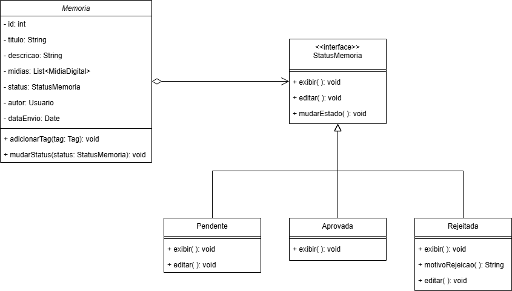
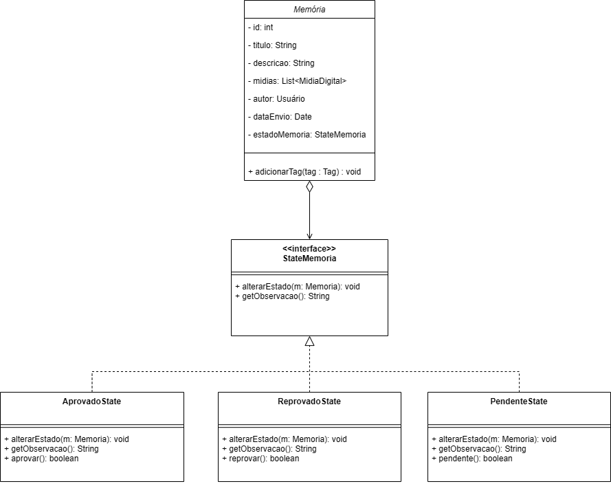
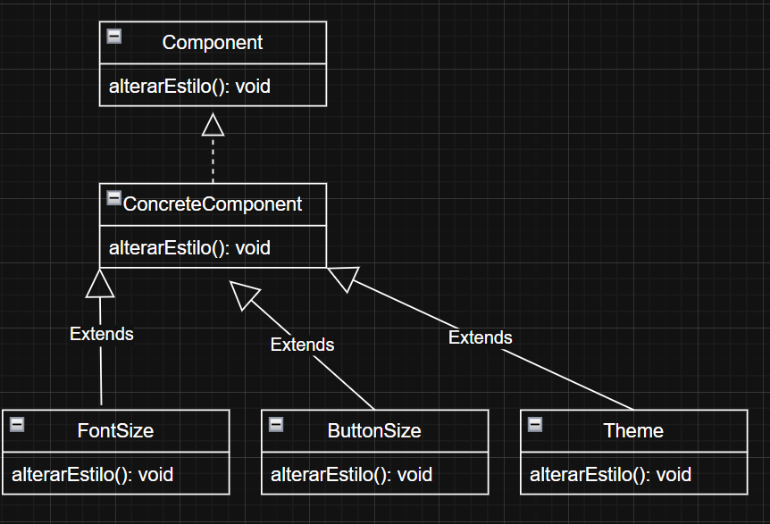

# State

## GoF FINAL


### Versões desenvolvidas

<details>
<summary>Versões desenvolvidas por integrante:</summary>

<details>
<summary>Versão do Gustavo:</summary>

### Gustavo

A implementação foi desenvolvida com base no exemplo disponibilizado pela professora no Aprender3 e, também baseado no site refactoring guru, adaptando-o para os nossos componentes.  

### Modelagem



<center>

Autor: [Gustavo Feitosa Haubert](https://github.com/GustavoHaubert)

</center>

### Código

```python

from abc import ABC, abstractmethod
from datetime import date

class StatusMemoria(ABC):
    @abstractmethod
    def exibir(self, memoria):
        pass

    @abstractmethod
    def editar(self, memoria):
        pass

    def mudarEstado(self, memoria, novo_status):
        memoria.mudarStatus(novo_status)


class Pendente(StatusMemoria):
    def exibir(self, memoria):
        print(f"[PENDENTE] Exibindo memória: {memoria.titulo}")

    def editar(self, memoria):
        print(f"[PENDENTE] Editando memória: {memoria.titulo}")

class Aprovada(StatusMemoria):
    def exibir(self, memoria):
        print(f"[APROVADA] Memória aprovada: {memoria.titulo}")

    def editar(self, memoria):
        print("[APROVADA] Não é possível editar uma memória aprovada.")

class Rejeitada(StatusMemoria):
    def exibir(self, memoria):
        print(f"[REJEITADA] Memória rejeitada: {memoria.titulo}")

    def editar(self, memoria):
        print("[REJEITADA] Editando memória para reenviar.")

    def motivoRejeicao(self):
        return "Motivo: conteúdo inadequado."


class Memoria:
    def __init__(self, id, titulo, descricao, autor):
        self.id = id
        self.titulo = titulo
        self.descricao = descricao
        self.autor = autor
        self.midias = []
        self.dataEnvio = date.today()
        self.status = Pendente()  # Estado inicial

    def adicionarTag(self, tag):
        print(f"Tag '{tag}' adicionada à memória '{self.titulo}'.")

    def mudarStatus(self, status: StatusMemoria):
        self.status = status
        print(f"Status da memória '{self.titulo}' alterado para {status.__class__.__name__}.")

    def exibir(self):
        self.status.exibir(self)

    def editar(self):
        self.status.editar(self)


```

<center>

Autor: [Gustavo Feitosa Haubert](https://github.com/GustavoHaubert)

</center>

</details>

<details>
<summary>Versão do Marcus:</summary>

### Marcus Escobar

### Modelagem



<center>

Autor: [Marcus Escobar](https://github.com/MarcusEscobar)

</center>


### Código

```python

from abc import ABC, abstractmethod
from datetime import date
from typing import List

class StateMemoria(ABC):#Interface
    
    @abstractmethod
    def alterar_estado(self, memoria: 'Memoria') -> None:
        pass

    @abstractmethod
    def get_observacao(self) -> str:
        pass

#Estados Concretos
class AprovadoState(StateMemoria):
    def alterar_estado(self, memoria: 'Memoria') -> None:
        print("Memória já está aprovada.")

    def get_observacao(self) -> str:
        return "Memória aprovada."

    def aprovar(self) -> bool:
        return True


class ReprovadoState(StateMemoria):
    def alterar_estado(self, memoria: 'Memoria') -> None:
        print("Alterando estado para 'Aprovado'.")
        memoria.estado_memoria = AprovadoState()

    def get_observacao(self) -> str:
        return "Memória reprovada."

    def reprovar(self) -> bool:
        return True


class PendenteState(StateMemoria):
    def alterar_estado(self, memoria: 'Memoria') -> None:
        print("Alterando estado para 'Reprovado'.")
        memoria.estado_memoria = ReprovadoState()

    def get_observacao(self) -> str:
        return "Memória pendente de aprovação."

    def pendente(self) -> bool:
        return True


class Memoria:
    def __init__(self, id: int, titulo: str, descricao: str, autor: Usuario):
        self.id = id
        self.titulo = titulo
        self.descricao = descricao
        self.midias: List[MidiaDigital] = []
        self.autor = autor
        self.data_envio = date.today()
        self.estado_memoria: StateMemoria = PendenteState()  # Estado inicial

    def adicionar_tag(self, tag: Tag) -> None:
        print(f"Tag '{tag.nome}' adicionada à memória.")

    def alterar_estado(self):
        self.estado_memoria.alterar_estado(self)

    def get_observacao_estado(self) -> str:
        return self.estado_memoria.get_observacao()

```

<center>

Autor: [Marcus Escobar](https://github.com/MarcusEscobar)

</center>

</details>

<details>
<summary>Versão da Maria Eduarda:</summary>

## Introdução
Este exemplo é só um modelo de como poderia ser feito!

O padrão **State** (Estado) é um padrão **comportamental** que permite que um objeto altere seu **comportamento quando seu estado interno muda**. Na prática, o objeto parece mudar de classe.

Esse padrão é especialmente útil quando temos objetos que podem estar em diferentes "modos" ou "estágios", e cada um desses estágios deve se comportar de forma diferente.

## Contexto

No nosso caso, temos uma classe chamada `Memoria`, que possui um campo `status`. Esse campo representa o estado atual de aprovação dessa memória, e pode assumir os seguintes estados:

- `StatusPendente`
- `StatusAprovada`
- `StatusRejeitada`

Cada um desses estados define comportamentos diferentes para os métodos `aprovar()` e `rejeitar()`.

Em vez de usar uma série de `if-else` ou `switch-case` gigantes, aplicamos o padrão **State** para delegar o comportamento diretamente ao objeto que representa o estado atual.

## Estrutura de Classes

- `Status`: classe base (interface) que define os métodos `aprovar()` e `rejeitar()`.
- `StatusPendente`, `StatusAprovada`, `StatusRejeitada`: classes concretas que implementam `Status` com comportamentos específicos.
- `Memoria`: classe que contém um `Status` e delega os métodos `aprovar()` e `rejeitar()` ao seu estado atual.



<center>

Autor: [Maria Eduarda Vieira ](https://github.com/DudaV228)

</center>

### Código
```python

# Interface base
class Status:
    def aprovar(self, memoria):
        raise NotImplementedError()

    def rejeitar(self, memoria):
        raise NotImplementedError()

# Estados concretos
class StatusPendente(Status):
    def aprovar(self, memoria):
        print("Memória aprovada!")
        memoria.set_status(StatusAprovada())

    def rejeitar(self, memoria):
        print("Memória rejeitada.")
        memoria.set_status(StatusRejeitada())

class StatusAprovada(Status):
    def aprovar(self, memoria):
        print("Já está aprovada!")

    def rejeitar(self, memoria):
        print("Não é possível rejeitar. Já está aprovada.")

class StatusRejeitada(Status):
    def aprovar(self, memoria):
        print("Não é possível aprovar. Já foi rejeitada.")

    def rejeitar(self, memoria):
        print("Já está rejeitada!")

# Classe de contexto
class Memoria:
    def __init__(self):
        self.status = StatusPendente()

    def set_status(self, novo_status):
        self.status = novo_status

    def aprovar(self):
        self.status.aprovar(self)

    def rejeitar(self):
        self.status.rejeitar(self)

    #Exemplo de uso
    m = Memoria()
    m.aprovar()    # Memória aprovada!
    m.rejeitar()   # Não é possível rejeitar. Já está aprovada.

```
<center>

Autor: [Marcus Escobar](https://github.com/MarcusEscobar)
Autor: [Maria Eduarda Vieira ](https://github.com/DudaV228)

</center>
</details>

</details>


## Referências Bibliográficas


## Histórico de Versão

| Versão |  Data  | Descrição | Autor(es) | Revisor(es) | Comentário do Revisor |
| :-: | :-: | :-: | :-: | :-: | :-: |
|   1.0  |  31/05 | adicionando versão individual da implementação do State     | Gustavo |  |  |
|   2.0  |  01/06 | adicionando versão individual da implementação do State     | Maria Eduarda |  |  |


