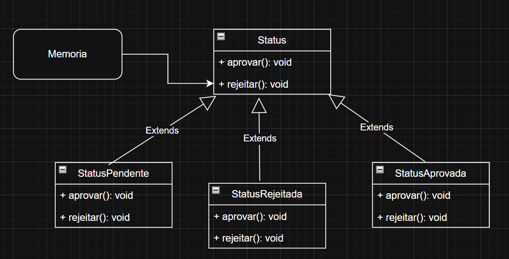

# State

## Introdução

O padrão **State** (Estado) faz parte dos padrões comportamentais do catálogo GoF. Ele permite que um objeto altere seu comportamento quando seu estado interno muda, dando a impressão de que a própria classe foi substituída. Em vez de usar condicionais (`if`/`switch`) espalhados pelo código para verificar o estado, define-se uma hierarquia de objetos-estado que encapsulam comportamentos específicos, delegando dinamicamente as chamadas ao objeto de estado atual.

---

## Elementos principais do State

- **Contexto (Context):** Classe principal que mantém uma referência ao objeto de estado atual e delega as solicitações de comportamento a ele. Modifica sua própria referência de estado conforme necessário.
- **Estado Abstrato (State):** Interface ou classe abstrata que declara os métodos que variam de acordo com o estado. Cada método representa uma ação ou operação cujo resultado depende do estado.
- **Estados Concretos (ConcreteStates):** Classes que implementam a interface de Estado, fornecendo diferentes comportamentos para cada operação. Cada implementação representa um modo ou fase distinta do contexto.
- **Transição de Estado:** Em geral, os próprios objetos de estado decidem para qual próximo estado o contexto deve evoluir, chamando um método do contexto que altera sua referência interna.

---

## Metodologia

O desenvolvimento desta seção do trabalho foi dividido entre os integrantes (**Edilson, Gustavo, Maria Eduarda e Marcus**). Cada um ficou responsável por:

1. **Estudar o padrão State:** Compreender sua estrutura, motivações e vantagens em cenários reais.
2. **Contruir um diagrama com tema escolhido:** Cada membro elaborou um diagrama do padrão State com base em seu entendimento.
3. **Reunião de consolidação:** Em encontro conjunto, apresentamos nossas versões, explicando a lógica de transição de estados, classes e interações.
4. **Seleção dos melhores elementos:** Analisamos quais componentes e abordagens se adequavam melhor ao escopo do projeto final.
5. **Construção unificada:** Incorporamos as ideias mais sólidas — seja de nomenclatura, modularidade, clareza de responsabilidades ou flexibilidade — ao exemplo final.

A dinâmica colaborativa permitiu enriquecer as discussões e chegar a uma solução que aproveitasse o que cada integrante considerou mais didático e robusto.

---

## Contexto

No aplicativo em que estamos inserindo o padrão State, assumiu-se um **sistema de gerenciamento de conteúdo**, em que registros (“Memória”) podem estar em diferentes fases: **Pendente**, **Aprovada** ou **Rejeitada**. O contexto principal é a classe `Memoria`, que delega ações como `aprovar()`, `rejeitar()` e `editar()` a objetos de estado concretos. Esse mecanismo elimina condicionais repetidas (por exemplo, verificações como `if estado == PENDENTE`) e isola cada comportamento em sua própria classe de estado. Assim, sempre que a `Memoria` muda de fase, basta alterar internamente seu objeto de estado, e os métodos passam a se comportar de acordo com as regras daquele novo estado (por exemplo, impedir edição quando já aprovada).

---

## Motivação da escolha

Optamos pelo **State** porque:

- **Clareza de responsabilidades:** Cada comportamento (aprovar, rejeitar, editar) num dado momento fica encapsulado em uma classe de estado, evitando código condicional espalhado.
- **Facilidade de manutenção:** Novas fases ou regras podem ser adicionadas criando-se novos objetos de estado, sem afetar o fluxo principal nem disparar regressões em outros estados.
- **Evolução dinâmica:** Em sistema de workflow ou processos que mudam de etapa, o State gerencia transições de forma mais limpa, sem “switch/case” ou “if” encadeado.
- **Legibilidade:** Facilita o entendimento de quais operações são permitidas em cada fase, já que cada classe de estado documenta isoladamente suas regras.

Dessa forma, o padrão State foi escolhido por oferecer modularidade, escalabilidade e legibilidade ao código de controle de fases de aprovação de conteúdo.

## GoF Final


## Código

Código final do GoF definido.

```python

from abc import ABC, abstractmethod
from datetime import date
from typing import List

class StateMemoria(ABC):#Interface

    @abstractmethod
    def alterar_estado(self, memoria: 'Memoria') -> None:
        pass

    @abstractmethod
    def get_observacao(self) -> str:
        pass

#Estados Concretos
class AprovadoState(StateMemoria):
    def alterar_estado(self, memoria: 'Memoria') -> None:
        print("Memória já está aprovada.")

    def get_observacao(self) -> str:
        return "Memória aprovada."

    def aprovar(self) -> bool:
        return True


class ReprovadoState(StateMemoria):
    def alterar_estado(self, memoria: 'Memoria') -> None:
        print("Alterando estado para 'Aprovado'.")
        memoria.estado_memoria = AprovadoState()

    def get_observacao(self) -> str:
        return "Memória reprovada."

    def reprovar(self) -> bool:
        return True


class PendenteState(StateMemoria):
    def alterar_estado(self, memoria: 'Memoria') -> None:
        print("Alterando estado para 'Reprovado'.")
        memoria.estado_memoria = ReprovadoState()

    def get_observacao(self) -> str:
        return "Memória pendente de aprovação."

    def pendente(self) -> bool:
        return True


class Memoria:
    def __init__(self, id: int, titulo: str, descricao: str, autor: Usuario):
        self.id = id
        self.titulo = titulo
        self.descricao = descricao
        self.midias: List[MidiaDigital] = []
        self.autor = autor
        self.data_envio = date.today()
        self.estado_memoria: StateMemoria = PendenteState()  # Estado inicial

    def adicionar_tag(self, tag: Tag) -> None:
        print(f"Tag '{tag.nome}' adicionada à memória.")

    def alterar_estado(self):
        self.estado_memoria.alterar_estado(self)

    def get_observacao_estado(self) -> str:
        return self.estado_memoria.get_observacao()

```

### Execução
Print da execução do código, para rodar basta clicar em run ou se direcionar a pasta onde está localizada o arquivo e digitar python "StateFinal.py"


### Versões desenvolvidas

<details>
<summary>Versões desenvolvidas por integrante:</summary>

<details>
<summary>Versão do Gustavo:</summary>

### Gustavo

A implementação foi desenvolvida com base no exemplo disponibilizado pela professora no Aprender3 e, também baseado no site refactoring guru, adaptando-o para os nossos componentes.

### Modelagem


<center>

Autor: [Gustavo Feitosa Haubert](https://github.com/GustavoHaubert)

</center>

### Código

```python

from abc import ABC, abstractmethod
from datetime import date

class StatusMemoria(ABC):
    @abstractmethod
    def exibir(self, memoria):
        pass

    @abstractmethod
    def editar(self, memoria):
        pass

    def mudarEstado(self, memoria, novo_status):
        memoria.mudarStatus(novo_status)


class Pendente(StatusMemoria):
    def exibir(self, memoria):
        print(f"[PENDENTE] Exibindo memória: {memoria.titulo}")

    def editar(self, memoria):
        print(f"[PENDENTE] Editando memória: {memoria.titulo}")

class Aprovada(StatusMemoria):
    def exibir(self, memoria):
        print(f"[APROVADA] Memória aprovada: {memoria.titulo}")

    def editar(self, memoria):
        print("[APROVADA] Não é possível editar uma memória aprovada.")

class Rejeitada(StatusMemoria):
    def exibir(self, memoria):
        print(f"[REJEITADA] Memória rejeitada: {memoria.titulo}")

    def editar(self, memoria):
        print("[REJEITADA] Editando memória para reenviar.")

    def motivoRejeicao(self):
        return "Motivo: conteúdo inadequado."


class Memoria:
    def __init__(self, id, titulo, descricao, autor):
        self.id = id
        self.titulo = titulo
        self.descricao = descricao
        self.autor = autor
        self.midias = []
        self.dataEnvio = date.today()
        self.status = Pendente()  # Estado inicial

    def adicionarTag(self, tag):
        print(f"Tag '{tag}' adicionada à memória '{self.titulo}'.")

    def mudarStatus(self, status: StatusMemoria):
        self.status = status
        print(f"Status da memória '{self.titulo}' alterado para {status.__class__.__name__}.")

    def exibir(self):
        self.status.exibir(self)

    def editar(self):
        self.status.editar(self)


```

<center>

Autor: [Gustavo Feitosa Haubert](https://github.com/GustavoHaubert)

</center>

</details>

<details>
<summary>Versão do Marcus:</summary>

### Marcus Escobar

### Modelagem


<center>

Autor: [Marcus Escobar](https://github.com/MarcusEscobar)

</center>

### Código

```python

from abc import ABC, abstractmethod
from datetime import date
from typing import List

class StateMemoria(ABC):#Interface

    @abstractmethod
    def alterar_estado(self, memoria: 'Memoria') -> None:
        pass

    @abstractmethod
    def get_observacao(self) -> str:
        pass

#Estados Concretos
class AprovadoState(StateMemoria):
    def alterar_estado(self, memoria: 'Memoria') -> None:
        print("Memória já está aprovada.")

    def get_observacao(self) -> str:
        return "Memória aprovada."

    def aprovar(self) -> bool:
        return True


class ReprovadoState(StateMemoria):
    def alterar_estado(self, memoria: 'Memoria') -> None:
        print("Alterando estado para 'Aprovado'.")
        memoria.estado_memoria = AprovadoState()

    def get_observacao(self) -> str:
        return "Memória reprovada."

    def reprovar(self) -> bool:
        return True


class PendenteState(StateMemoria):
    def alterar_estado(self, memoria: 'Memoria') -> None:
        print("Alterando estado para 'Reprovado'.")
        memoria.estado_memoria = ReprovadoState()

    def get_observacao(self) -> str:
        return "Memória pendente de aprovação."

    def pendente(self) -> bool:
        return True


class Memoria:
    def __init__(self, id: int, titulo: str, descricao: str, autor: Usuario):
        self.id = id
        self.titulo = titulo
        self.descricao = descricao
        self.midias: List[MidiaDigital] = []
        self.autor = autor
        self.data_envio = date.today()
        self.estado_memoria: StateMemoria = PendenteState()  # Estado inicial

    def adicionar_tag(self, tag: Tag) -> None:
        print(f"Tag '{tag.nome}' adicionada à memória.")

    def alterar_estado(self):
        self.estado_memoria.alterar_estado(self)

    def get_observacao_estado(self) -> str:
        return self.estado_memoria.get_observacao()

```

<center>

Autor: [Marcus Escobar](https://github.com/MarcusEscobar)

</center>

</details>

<details>
<summary>Versão da Maria Eduarda:</summary>

## Introdução

Este exemplo é só um modelo de como poderia ser feito!

O padrão **State** (Estado) é um padrão **comportamental** que permite que um objeto altere seu **comportamento quando seu estado interno muda**. Na prática, o objeto parece mudar de classe.

Esse padrão é especialmente útil quando temos objetos que podem estar em diferentes "modos" ou "estágios", e cada um desses estágios deve se comportar de forma diferente.

## Contexto

No nosso caso, temos uma classe chamada `Memoria`, que possui um campo `status`. Esse campo representa o estado atual de aprovação dessa memória, e pode assumir os seguintes estados:

- `StatusPendente`
- `StatusAprovada`
- `StatusRejeitada`

Cada um desses estados define comportamentos diferentes para os métodos `aprovar()` e `rejeitar()`.

Em vez de usar uma série de `if-else` ou `switch-case` gigantes, aplicamos o padrão **State** para delegar o comportamento diretamente ao objeto que representa o estado atual.

## Estrutura de Classes

- `Status`: classe base (interface) que define os métodos `aprovar()` e `rejeitar()`.
- `StatusPendente`, `StatusAprovada`, `StatusRejeitada`: classes concretas que implementam `Status` com comportamentos específicos.
- `Memoria`: classe que contém um `Status` e delega os métodos `aprovar()` e `rejeitar()` ao seu estado atual.



<center>

Autor: [Maria Eduarda Vieira ](https://github.com/DudaV228)

</center>

### Código

```python

# Interface base
class Status:
    def aprovar(self, memoria):
        raise NotImplementedError()

    def rejeitar(self, memoria):
        raise NotImplementedError()

# Estados concretos
class StatusPendente(Status):
    def aprovar(self, memoria):
        print("Memória aprovada!")
        memoria.set_status(StatusAprovada())

    def rejeitar(self, memoria):
        print("Memória rejeitada.")
        memoria.set_status(StatusRejeitada())

class StatusAprovada(Status):
    def aprovar(self, memoria):
        print("Já está aprovada!")

    def rejeitar(self, memoria):
        print("Não é possível rejeitar. Já está aprovada.")

class StatusRejeitada(Status):
    def aprovar(self, memoria):
        print("Não é possível aprovar. Já foi rejeitada.")

    def rejeitar(self, memoria):
        print("Já está rejeitada!")

# Classe de contexto
class Memoria:
    def __init__(self):
        self.status = StatusPendente()

    def set_status(self, novo_status):
        self.status = novo_status

    def aprovar(self):
        self.status.aprovar(self)

    def rejeitar(self):
        self.status.rejeitar(self)

    #Exemplo de uso
    m = Memoria()
    m.aprovar()    # Memória aprovada!
    m.rejeitar()   # Não é possível rejeitar. Já está aprovada.

```

<center>

Autor: [Maria Eduarda Vieira ](https://github.com/DudaV228)

</center>

</details>

<details>
<summary>Versão do Edilson:</summary>

### Edilson

### Modelagem


<center>

Autor: [Edilson Ribeiro da Cruz Junior](https://github.com/edilson-r-jr)

</center>

### Código

```python

from abc import ABC, abstractmethod
from datetime import datetime
from typing import List


class EstadoMemoria(ABC):
    @abstractmethod
    def aprovar(self, memoria: "Memoria") -> None:
        pass

    @abstractmethod
    def rejeitar(self, memoria: "Memoria") -> None:
        pass

    @abstractmethod
    def editar(self, memoria: "Memoria", novo_titulo: str, nova_descricao: str) -> None:
        pass


class EstadoPendente(EstadoMemoria):
    def aprovar(self, memoria: "Memoria") -> None:
        memoria.set_estado(EstadoAprovada())
        print(f"[EstadoPendente] Memória {memoria.id} aprovada.")

    def rejeitar(self, memoria: "Memoria") -> None:
        memoria.set_estado(EstadoRejeitada())
        print(f"[EstadoPendente] Memória {memoria.id} rejeitada.")

    def editar(self, memoria: "Memoria", novo_titulo: str, nova_descricao: str) -> None:
        memoria.titulo = novo_titulo
        memoria.descricao = nova_descricao
        print(f"[EstadoPendente] Memória {memoria.id} editada para título='{novo_titulo}', descrição='{nova_descricao}'.")


class EstadoAprovada(EstadoMemoria):
    def aprovar(self, memoria: "Memoria") -> None:
        print(f"[EstadoAprovada] Memória {memoria.id} já está aprovada.")

    def rejeitar(self, memoria: "Memoria") -> None:
        print(f"[EstadoAprovada] Não é permitido rejeitar a memória {memoria.id} que já foi aprovada.")

    def editar(self, memoria: "Memoria", novo_titulo: str, nova_descricao: str) -> None:
        print(f"[EstadoAprovada] Não é permitido editar a memória {memoria.id} aprovada.")


class EstadoRejeitada(EstadoMemoria):
    def aprovar(self, memoria: "Memoria") -> None:
        print(f"[EstadoRejeitada] Não é permitido aprovar a memória {memoria.id} rejeitada.")

    def rejeitar(self, memoria: "Memoria") -> None:
        print(f"[EstadoRejeitada] Memória {memoria.id} já está rejeitada.")

    def editar(self, memoria: "Memoria", novo_titulo: str, nova_descricao: str) -> None:
        print(f"[EstadoRejeitada] Não é permitido editar a memória {memoria.id} rejeitada.")


class Memoria:
    def __init__(
        self,
        id: int,
        titulo: str,
        descricao: str,
        midias: List[MidiaDigital],
        autor: Usuario,
        data_envio: datetime,
    ):
        self.id = id
        self.titulo = titulo
        self.descricao = descricao
        self.midias = midias
        self.autor = autor
        self.data_envio = data_envio
        self.tags: List[Tag] = []
        self.estado: EstadoMemoria = EstadoPendente()

    def set_estado(self, novo_estado: EstadoMemoria) -> None:
        self.estado = novo_estado

    def aprovar(self) -> None:
        self.estado.aprovar(self)

    def rejeitar(self) -> None:
        self.estado.rejeitar(self)

    def editar(self, novo_titulo: str, nova_descricao: str) -> None:
        self.estado.editar(self, novo_titulo, nova_descricao)

    def adicionar_tag(self, tag: Tag) -> None:
        self.tags.append(tag)
        print(f"[Memoria] Tag '{tag.nome}' adicionada à memória {self.id}.")


```

<center>

</details>

</details>

## Referências Bibliográficas

[1] SERRANO, Milene. AULA - GOFS COMPORTAMENTAIS. Slides. Universidade de Brasília, 2025. Acessado em: 23 de mai. de 2025.

[2] Gamma, E., Helm, R., Johnson, R., & Vlissides, J. (1994). Design Patterns: Elements of Reusable Object-Oriented Software. Addison-Wesley.<br>

## Histórico de Versão

| Versão | Data  |                        Descrição                        |    Autor(es)    | Revisor(es) |          Comentário do Revisor          |
| :----: | :---: | :-----------------------------------------------------: | :-------------: | :---------: | :-------------------------------------: |
|  1.0   | 31/05 | adicionando versão individual da implementação do State |     Gustavo     |             |                                         |
|  1.1   | 01/06 | adicionando versão individual da implementação do State |  Maria Eduarda  |   Edilson   | As imagens estavam trocadas, consertado |
|  1.2   | 01/06 | adicionando versão individual da implementação do State | Marcus Escobar  |             |                                         |
|  1.3   | 01/06 | adicionando versão individual da implementação do State | Edilson Ribeiro |             |                                         |
|  1.4   | 01/06 |       adicionando texto explicando o padrão State       | Edilson Ribeiro |             |                                         |
|  1.5   | 01/06 |          adicionando o Diagrama final e Codigo          | Edilson Ribeiro |             |                                         |
|  1.6   | 02/06 |          adicionando o executável do Codigo          | Maria Eduarda, Edilson Ribeiro, Marcus Escobar, Gustavo  |       |                                         |
