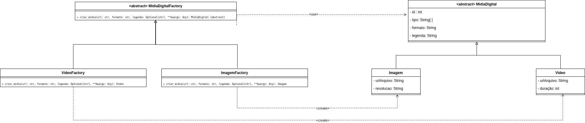
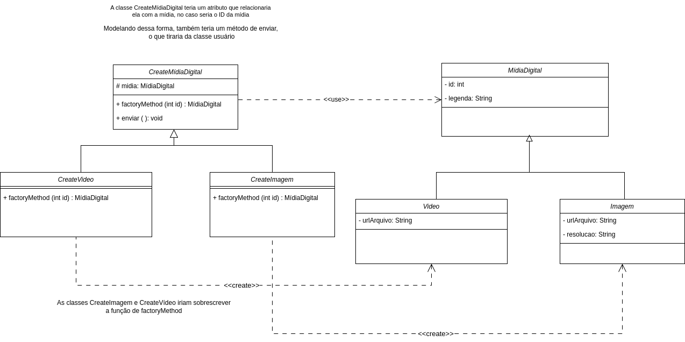

# Factory Method

## Introdução
O Factory Method é um padrão de design criacional que define uma interface para a criação de objetos, delegando às subclasses a responsabilidade de determinar quais tipos específicos de objetos devem ser instanciados. Esse padrão é particularmente valioso em cenários onde é necessário desacoplar o código cliente das classes concretas, promovendo maior flexibilidade, reutilização e escalabilidade no sistema.

## Elementos principais do Factory Method [1]

- **Product (Produto)**: Define a interface ou classe base para os objetos que serão criados pelo Factory Method.
- **ConcreteProduct (Produto Concreto)**: Implementa a interface do produto, sendo a classe real que será instanciada.
- **Creator (Criador)**: Declara o método de fábrica, que retorna objetos do tipo **Product**. Pode incluir uma implementação padrão do método.
- **ConcreteCreator (Criador Concreto)**: Substitui ou implementa o método de fábrica para criar instâncias específicas de **ConcreteProduct**. 

## Metodologia

Decidimos em [reunião](../../AtasDeReunião/reuniao2305.md) aprofundar nossos estudos no Gof Criacional **Factory Method**, e logo optamos por aplicar o padão na classe **MídiaDigital**.

Dividimos o trabalho entre quatro alunos, cada um sendo responsável por estudar e desenvolver sua própria versão individualmente. Posteriormente, comparamos as ideias em reunião e selecionamos os melhores elementos de cada versão para compor uma solução final unificada. Cada um apresentou sua ideia e como construiu sua versão, o que enriqueceu a discussão.


### Versões desenvolvidas

<details>
<summary>Versão do Marcos Marinho:</summary>

### Marcos

A implementação foi desenvolvida com base no exemplo disponibilizado pela professora no Aprender3, adaptando-o para os nossos componentes.  

### Modelagem



<center>

Autor: [Marcos Vieira Marinho](https://github.com/devMarcosVM)

</center>

### Código

```python
from abc import ABC, abstractmethod
from typing import Optional, Any, Dict

# --- Produto Abstrato ---
class MidiaDigital(ABC):
    """
    Classe base abstrata para todos os tipos de mídia digital.
    Define a interface comum.
    """
    def __init__(self, url: str, formato: str, legenda: Optional[str] = None):
        self.url = url
        self.formato = formato
        self.legenda = legenda if legenda else "Mídia sem legenda"

    @abstractmethod
    def exibir_detalhes(self) -> None:
        """
        Método abstrato para exibir os detalhes específicos da mídia.
        As subclasses concretas devem implementar este método.
        """
        print(f"URL: {self.url}")
        print(f"Formato: {self.formato}")
        print(f"Legenda: {self.legenda}")

# --- Produtos Concretos ---
class Video(MidiaDigital):
    """
    Representa um arquivo de vídeo, um tipo de MidiaDigital.
    """
    def __init__(self, url: str, formato: str, legenda: Optional[str] = None, duracao: str = "00:00"):
        super().__init__(url, formato, legenda)
        self.duracao = duracao # Atributo específico do vídeo

    def exibir_detalhes(self) -> None:
        print("--- Detalhes do Vídeo ---")
        super().exibir_detalhes()
        print(f"Duração: {self.duracao}")
        print("-------------------------")

class Imagem(MidiaDigital):
    """
    Representa um arquivo de imagem, um tipo de MidiaDigital.
    """
    def __init__(self, url: str, formato: str, legenda: Optional[str] = None, resolucao: str = "N/A"):
        super().__init__(url, formato, legenda)
        self.resolucao = resolucao # Atributo específico da imagem

    def exibir_detalhes(self) -> None:
        print("--- Detalhes da Imagem ---")
        super().exibir_detalhes()
        print(f"Resolução: {self.resolucao}")
        print("--------------------------")

# --- Fábrica Abstrata (Creator Abstrato) ---
class AbstractMidiaFactory(ABC):
    """
    Interface abstrata para as fábricas de MidiaDigital.
    Define o Factory Method 'criar_midia'.
    """
    @abstractmethod
    def criar_midia(self, url: str, formato: str, legenda: Optional[str] = None, **kwargs: Any) -> MidiaDigital:
        """
        Factory Method: As subclasses concretas implementarão este método
        para criar um tipo específico de MidiaDigital.
        """
        pass

# --- Fábricas Concretas (Concrete Creators) ---
class VideoFactory(AbstractMidiaFactory):
    """
    Fábrica concreta para criar objetos Video.
    """
    def criar_midia(self, url: str, formato: str, legenda: Optional[str] = None, **kwargs: Any) -> Video:
        duracao = kwargs.get("duracao", "00:00")
        return Video(url, formato, legenda, duracao=duracao)

class ImagemFactory(AbstractMidiaFactory):
    """
    Fábrica concreta para criar objetos Imagem.
    """
    def criar_midia(self, url: str, formato: str, legenda: Optional[str] = None, **kwargs: Any) -> Imagem:
        resolucao = kwargs.get("resolucao", "N/A")
        return Imagem(url, formato, legenda, resolucao=resolucao)
    
```
<center>

Autor: [Marcos Vieira Marinho](https://github.com/devMarcosVM)

</center>

</details>


<details>
<summary>Versão do Mateus Henrique: </summary>

### Mateus

A implementação foi desenvolvida com base no exemplo disponibilizado pela professora no Aprender3, adaptando-o para os nossos componentes.  

### Modelagem

<iframe frameborder="0" style="width:100%;height:1093px;" src="https://viewer.diagrams.net/?tags=%7B%7D&lightbox=1&highlight=0000ff&edit=_blank&layers=1&nav=1&title=classes.drawio&dark=0#R%3Cmxfile%3E%3Cdiagram%20name%3D%22P%C3%A1gina-1%22%20id%3D%22nnV4It4wvfA8yrZHrYJC%22%3E7Vxdc9o4FP01zLSdIWPZxsBjgLTdnWQ2s9np7j51BBZGjbAYWYSwv34lW%2F6QZQgUm5DGvARdS9eWztHVuZJJxxkvn78wuFrcUR%2BRjm35zx1n0rHlZyD%2BSMs2sfSHbmIIGPYTE8gND%2Fg%2FpIyWsq6xjyKtIqeUcLzSjTMahmjGNRtkjG70anNK9LuuYIAMw8MMEtP6N%2Fb5IrEO7H5u%2F4pwsEjvDLxhcmUJ08qqJ9EC%2BnRTMDk3HWfMKOXJt%2BXzGBE5eOm4JO0%2B77iaPRhDIT%2BkwejHDwLx59%2FB3U2X3qPg5qs37fYSL0%2BQrFWH77CP4Wc445RtO7YHl6uOMyLiDiO9BKcRZ6JaZg20OqoUd5xv09GMNnhJYChKozkN%2BYO6AqQ%2FgoNQfJ%2BJ7iAmDE%2BIcSyAuFYXOJV%2BZwtM%2FFu4pWvZ6YjD2WNaGi0ow%2F8Jt5Aon%2BIy44pTtqfVeJAthdkSVoYiUec%2BHUlQMt3BZ63iLYy4MswoIXAV4WnWjSVkAQ5HlHO6VJU2C8zRwwrOZJ2NmCbyQfgyfUgTRwWtHAD0XDApXL8gukRcomOpSQVcJ2myySnq9BXvFgV6esoG1awIMlc5ccQXxZ0jeNQ3eGRgT3CMu2ANfczmkhyAOSZkTAkVoE9CGldKyUDQnFdQYYl9n8TOxKjiMPhLUmPSBbnlNm44cXLLn2oUpIlRDjlMQJMIEThF5J5GmGMq%2FbOk7mhFccjjoeqNOr1JbGF8TENJfRzDhQQZNkgSQvUs7QkOF4hhXgnw3ql4MOqC0QeBPmgI80EF5nkACKdRPF8ZhuxDhMi8Y4vbWGsm7nEdM4MlljllIlbSkpWgAIU%2BTKx%2FrCQwYlr35CBLJOI6nz49bsR0iz4aXBMjaCKiuHU83ZLIozPLNZklTVS0nZM4zC8ESVFYwTadVSOB2Ni66qle9UYgL79IuaNDSz3Mc9zDmJcytHbq9czwgnyxbqsiIlO6uckNAoJ16CNfASAGdEEDSahbGkcOOVY%2FEOdbtVbAteTjKHYjiikf9MH1YbSIXe4N4hFdsxna0xUlF8RKFaB9INmqouznXowYIpDjJ12%2FVCEQN71mDG4LFRQ5c8%2F30iAqKGL0egpnRQV3aJXQTDzm2GaPdgLcw4pQo8eZrrg8ZghyJL50y1cr2XIro76O6YsiJFt5Yimwc1JPjph89o7Zl2ladRdNNmqIq1bWFQCDnoZOV3k6jhMG6F1QWkPofB4JtpancQ1Qm0h%2F64ydzvXERzRTpa2qbFRVplf7%2BlR3LKsi7LtnVJkAGOxoZeaRMnN4MA32ycwK1JuSmcCuAH0kw2MrLS9eWh7NtkppWcG25qRl%2F%2FWlpRhTtv1HuhRgqeK%2FxWuTdO1ISltVqkmSAudATepYl6FJbX2h8qxzaFIz%2FS1r0MvVnOl2TQ2a07KHji4TTpOczUvMlN4F5H5bwgAtW315Vn3ZzQTlHoHpWufcxgTmfngrMI8UmNn0OkVhVsLemML0qhVmu5P51uTm8dyr0JuV3GtMbzq9vXozF5Sni85qhen2M0OsMa8sx35BZ8alexEWxBDIVS82nkFvDuqWm6ch57175A7dvL4s4NzXnXJdIZotDTnrauC5P4OclvChZ8wTYgyHnion3oGtirlvWdgWCvVxonasq5M%2Bt3QQAfoleZA8qGqVM8Zw1HeHVwNnmH%2FKbq9cr3DZ1e%2BSUN%2B4S125imtKE5llrqNLTzHdXYeKP5NiDvpAA6WuYw3H1t3auofmUtB048RIQQ1E29zTFINL%2BgTz9kXKgpJIjc9pEUHFMvJxsUjo7DEL6zo1a8pzB8NSmmubaS7wKjRn393N6NOUi3mOIqOKzDXod0gEm0I5r1Qm88CZyA3eTmYCzpqZ7Cdj3eTbH01OybgrGdhc1lN1qNNutCQbLTmlrI65JBcpZemUsoqUAgalqnVdTZRK32N4iVJNbeI45q5uckwo1O0Us%2B84nNMPH9uI9otGtEPpl8aZ%2BpNKM4CddzegB8q7AXZ2eHhMTnkR6urFLDNlyItbD27tZ5Qn0cQ2E7pv2Ee0Ff6%2FnvD37J8U%2FoOmZJdtvqcvhb%2B%2FZnAGW7n%2FNhbHLIS8HblvV%2F1W4G3IfXBGuf%2BGKPXacj99Hb6V%2B%2B8yonkHrqTNbWCYK2n8y8kJDrBUVe0vJ1s5WJKD%2FfKJlXsgiYHd2EZw9UuM2astaeT0YuL6%2BEl8jfkpa2mvu%2Bg1xcMUKu9or70Ys799G7kvNHI7u94kPVmLeo1xvko5tFr0YrTo8ZQaHppWN8Qo1zzNbbXo%2B4low8Era1EXGHw699az13k%2FW88pjpez9SyK%2Bf%2BRSd5Ryf8bj3PzPw%3D%3D%3C%2Fdiagram%3E%3C%2Fmxfile%3E"></iframe>

<center>

Autor: [Mateus Henrique](https://github.com/Mateushqms)

</center>

### Código

```python
from abc import ABC, abstractmethod
from typing import Optional, Dict


# Produto abstrato
class MidiaDigital(ABC):
    def __init__(self, url: str, formato: str, legenda: Optional[str] = None):
        self.url = url
        self.formato = formato
        self.legenda = legenda or "Sem legenda"

    @abstractmethod
    def exibir_info(self) -> str:
        pass


# Produtos concretos
class Imagem(MidiaDigital):
    def __init__(self, url: str, formato: str, legenda: Optional[str] = None, texto_alternativo: str = ""):
        super().__init__(url, formato, legenda)
        self.texto_alternativo = texto_alternativo

    def exibir_info(self) -> str:
        return f"[Imagem] URL: {self.url} | Alt: {self.texto_alternativo} | Formato: {self.formato} | Legenda: {self.legenda}"


class Video(MidiaDigital):
    def __init__(self, url: str, formato: str, legenda: Optional[str] = None, duracao: str = "00:00"):
        super().__init__(url, formato, legenda)
        self.duracao = duracao

    def exibir_info(self) -> str:
        return f"[Vídeo] URL: {self.url} | Duração: {self.duracao} | Formato: {self.formato} | Legenda: {self.legenda}"


# Fabricas concretas
class MidiaFactory(ABC):
    @abstractmethod
    def criar(self, url: str, formato: str, legenda: Optional[str], **kwargs) -> MidiaDigital:
        pass


class ImagemFactory(MidiaFactory):
    def criar(self, url: str, formato: str, legenda: Optional[str], **kwargs) -> Imagem:
        return Imagem(url, formato, legenda, texto_alternativo=kwargs.get("texto_alternativo", ""))


class VideoFactory(MidiaFactory):
    def criar(self, url: str, formato: str, legenda: Optional[str], **kwargs) -> Video:
        return Video(url, formato, legenda, duracao=kwargs.get("duracao", "00:00"))


# Gerenciador de fabricas
class GerenciadorMidia:
    def __init__(self):
        self.fabricas: Dict[str, MidiaFactory] = {}
        self.registrar_fabrica("imagem", ImagemFactory())
        self.registrar_fabrica("video", VideoFactory())

    def registrar_fabrica(self, tipo: str, fabrica: MidiaFactory):
        self.fabricas[tipo.lower()] = fabrica

    def criar_midia(self, tipo: str, url: str, formato: str, legenda: Optional[str] = None, **kwargs) -> MidiaDigital:
        fabrica = self.fabricas.get(tipo.lower())
        if not fabrica:
            raise ValueError(f"Tipo de mídia não suportado: {tipo}")
        return fabrica.criar(url, formato, legenda, **kwargs)

    
```
<center>

Autor: [Mateus Henrique](https://github.com/Mateushqms)

</center>

</details>

<details>
<summary>Versão da Manuella:</summary>

### Manuella

Este projeto implementa o padrão de projeto Factory Method com o objetivo de encapsular a criação de diferentes tipos de mídias digitais, como vídeos e imagens no envio de `memórias`.

- `MidiaDigital` é o produto abstrato.

- `Video` e `Imagem` são os produtos concretos.

- `CreateMidiaDigital` é o criador abstrato com o método factory_method.

- `CreateVideo` e `CreateImagem` são os criadores concretos.

### Modelagem



<center>

Autor: [Manuella Magalhães Valadares](https://github.com/manuvaladares)

</center>

### Código

```python
from abc import ABC, abstractmethod

# Produto
class MidiaDigital(ABC):
    def __init__(self, id: int, legenda: str):
        self.id = id
        self.legenda = legenda

# Produto Concreto 1
class Video(MidiaDigital):
    def __init__(self, id: int, legenda: str, url_arquivo: str):
        super().__init__(id, legenda)
        self.url_arquivo = url_arquivo

# Produto Concreto 2
class Imagem(MidiaDigital):
    def __init__(self, id: int, legenda: str, url_arquivo: str, resolucao: str):
        super().__init__(id, legenda)
        self.url_arquivo = url_arquivo
        self.resolucao = resolucao

# Creator (fábrica abstrata)
class CreateMidiaDigital(ABC):
    def __init__(self):
        self.midia = None

    @abstractmethod
    def factory_method(self, id: int) -> MidiaDigital:
        pass

    def enviar(self):
        print(f"Enviando mídia com ID {self.midia.id} e legenda: {self.midia.legenda}")

# Fábrica concreta para vídeo
class CreateVideo(CreateMidiaDigital):
    def factory_method(self, id: int) -> MidiaDigital:
        self.midia = Video(id=id, legenda="Vídeo institucional", url_arquivo="video.mp4")
        return self.midia

# Fábrica concreta para imagem
class CreateImagem(CreateMidiaDigital):
    def factory_method(self, id: int) -> MidiaDigital:
        self.midia = Imagem(id=id, legenda="Imagem promocional", url_arquivo="imagem.jpg", resolucao="1920x1080")
        return self.midia
    
```
<center>

Autor: [Manuella Magalhães Valadares](https://github.com/manuvaladares)

</center>

</details>

## Referências

[1] Gamma, E., Helm, R., Johnson, R., & Vlissides, J. (1994). Design Patterns: Elements of Reusable Object-Oriented Software. Addison-Wesley.


## Histórico de Versão

| Versão | Data | Descrição | Autor(es) | Revisor(es) | Comentário do Revisor |
| :-: | :-: | :-: | :-: | :-: | :-: |
| 1.0 | 26/05 | adicionando versão individual da implementação do Factory Method | Marcos Marinho | - | - |
| 1.1 | 26/05 | Adicionando versão individual do Factory Method | Mateus | - | - |
| 1.2 | 26/05 | Adicionando versão individual do Factory Method | Manuella | - | - |
| 1.3 | 26/05 | Adicionando introdução, metodologia e referências | Manuella | - | - |