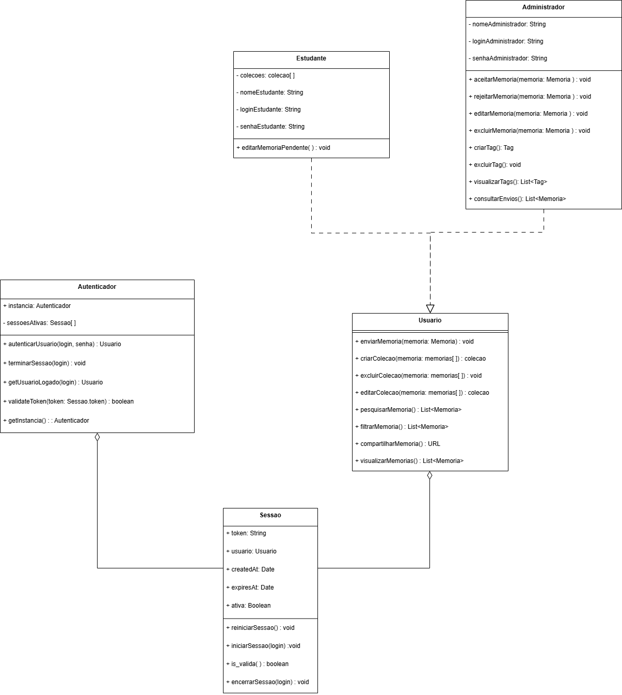
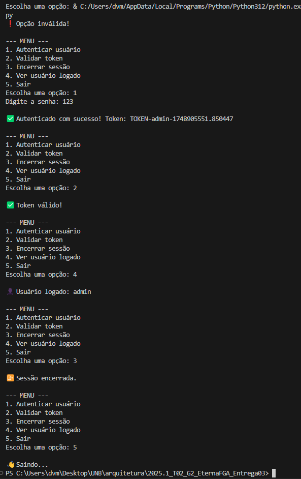
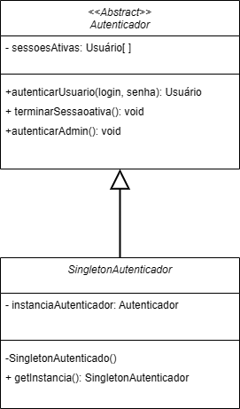
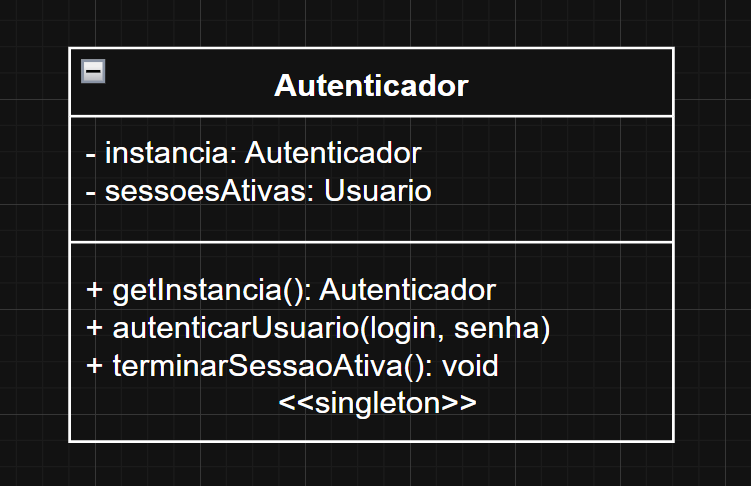
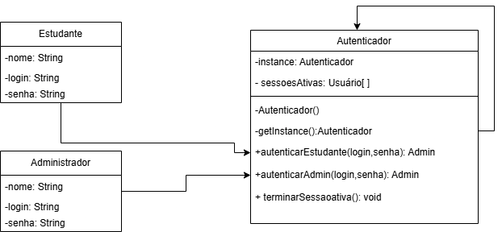

# Singleton

## Introdução

O padrão de projeto **Singleton** é um dos padrões criacionais mais utilizados em Engenharia de Software. Seu objetivo é garantir que uma determinada classe tenha **apenas uma única instância** durante todo o ciclo de vida da aplicação. Além disso, ele fornece um **ponto de acesso global** a essa instância.

Esse padrão é útil em cenários onde é necessário compartilhar informações ou recursos entre diferentes partes da aplicação, como:

- Conexão com banco de dados
- Configurações da aplicação
- Sistemas de autenticação (como no nosso caso)

## Elementos principais do Singleton

- **Classe Singleton**: É a classe que controla sua própria instância. Ela deve impedir a criação de múltiplos objetos por meio de:

- Um construtor privado ou protegido;

- Um atributo estático que armazena a única instância;

- Um método público estático (geralmente chamado de getInstance) que retorna essa instância única, criando-a se ainda não existir.

## Metodologia

O desenvolvimento desta seção do trabalho foi dividido entre os integrantes (Edilson, Gustavo, Maria Eduarda e Marcus), onde cada um ficou responsável por entender o padrão Singleton e propor um exemplo de aplicação. Posteriormente, comparamos as ideias em reunião e selecionamos os melhores elementos de cada versão para compor uma solução final unificada. Cada um apresentou sua ideia e como construiu sua versão, o que enriqueceu a discussão.

### Contexto

Implementamos o padrão Singleton em uma classe chamada `Autenticador`, que é responsável por autenticar usuários e armazenar o usuário atualmente logado.

Mesmo que a aplicação tente criar várias instâncias do `Autenticador`, o Singleton garante que **todas as referências apontem para a mesma instância**. Com o padrão Singleton aplicado, garantimos que a classe Autenticador seja uma única fonte de verdade para o controle de autenticação no sistema. Isso previne comportamentos inconsistentes e facilita a manutenção da lógica de login.

### Motivação da escolha

O padrão Singleton foi escolhido para garantir que as configurações da aplicação fossem centralizadas em uma única instância, evitando inconsistências causadas por múltiplas cópias dessas informações. Além disso, o Singleton fornece um acesso global controlado e evita a necessidade de passar objetos de configuração entre componentes. Por isso, achamos que o melhor padrão para fazer um autenticador seria o Singleton, pois o autenticador terá apenas uma instância e será responsável por controlar as sessões e autenticar as contas. 

## GoF FINAL

Decidimos em uma reunião que o GoF final será o diagrama abaixo:



### Código

```python
from datetime import datetime, timedelta
from typing import Optional, List

class Sessao:
    def __init__(self, token: str, usuario: str, duracao_minutos: int = 30):
        self.token = token
        self.usuario = usuario
        self.createdAt = datetime.now()
        self.expiresAt = self.createdAt + timedelta(minutes=duracao_minutos)
        self.ativa = True

    def reiniciarSessao(self):
        self.createdAt = datetime.now()
        self.expiresAt = self.createdAt + timedelta(minutes=30)
        self.ativa = True

    def iniciarSessao(self):
        self.createdAt = datetime.now()
        self.expiresAt = self.createdAt + timedelta(minutes=30)
        self.ativa = True

    def is_valida(self) -> bool:
        return self.ativa and datetime.now() < self.expiresAt

    def encerrarSessao(self):
        self.ativa = False


# --- Singleton ---
class Autenticador:
    __instancia = None

    def __init__(self):
        if Autenticador.__instancia is not None:
            raise Exception("Esta classe é um singleton! Use get_instancia().")
        self.sessoesAtivas: List[Sessao] = []

    @staticmethod
    def get_instancia():
        if Autenticador.__instancia is None:
            Autenticador.__instancia = Autenticador()
        return Autenticador.__instancia

    def autenticarUsuario(self, login: str, senha: str) -> Optional[str]:
        if login == "admin" and senha == "123":
            token = f"TOKEN-{login}-{datetime.now().timestamp()}"
            nova_sessao = Sessao(token, login)
            self.sessoesAtivas.append(nova_sessao)
            return token
        return None

    def terminarSessao(self, login: str):
        for sessao in self.sessoesAtivas:
            if sessao.usuario == login:
                sessao.encerrarSessao()

    def getUsuarioLogado(self, login: str) -> Optional[str]:
        for sessao in self.sessoesAtivas:
            if sessao.usuario == login and sessao.is_valida():
                return login
        return None

    def validateToken(self, token: str) -> bool:
        for sessao in self.sessoesAtivas:
            if sessao.token == token and sessao.is_valida():
                return True
        return False

```

### Execução
Print da execução do código, para rodar basta clicar em run ou se direcionar a pasta onde está localizada o arquivo e digitar python "singletonFinal.py"



### Versões desenvolvidas

<details>
<summary>Versões desenvolvidas por integrante:</summary>

<details>
<summary>Versão do Gustavo:</summary>

### Gustavo

A implementação foi desenvolvida com base no exemplo disponibilizado pela professora no Aprender3 e, também baseado no site refactoring guru, adaptando-o para os nossos componentes.

### Modelagem


<center>

Autor: [Gustavo Feitosa Haubert](https://github.com/GustavoHaubert)

</center>

### Código

```python
from datetime import datetime, timedelta
from typing import Optional, List

class Sessao:
    def __init__(self, token: str, usuario: str, duracao_minutos: int = 30):
        self.token = token
        self.usuario = usuario
        self.createdAt = datetime.now()
        self.expiresAt = self.createdAt + timedelta(minutes=duracao_minutos)
        self.ativa = True

    def reiniciarSessao(self):
        self.createdAt = datetime.now()
        self.expiresAt = self.createdAt + timedelta(minutes=30)
        self.ativa = True

    def iniciarSessao(self):
        self.createdAt = datetime.now()
        self.expiresAt = self.createdAt + timedelta(minutes=30)
        self.ativa = True

    def is_valida(self) -> bool:
        return self.ativa and datetime.now() < self.expiresAt

    def encerrarSessao(self):
        self.ativa = False


# --- Singleton ---
class Autenticador:
    __instancia = None

    def __init__(self):
        if Autenticador.__instancia is not None:
            raise Exception("Esta classe é um singleton! Use get_instancia().")
        self.sessoesAtivas: List[Sessao] = []

    @staticmethod
    def get_instancia():
        if Autenticador.__instancia is None:
            Autenticador.__instancia = Autenticador()
        return Autenticador.__instancia

    def autenticarUsuario(self, login: str, senha: str) -> Optional[str]:
        if login == "admin" and senha == "123":
            token = f"TOKEN-{login}-{datetime.now().timestamp()}"
            nova_sessao = Sessao(token, login)
            self.sessoesAtivas.append(nova_sessao)
            return token
        return None

    def terminarSessao(self, login: str):
        for sessao in self.sessoesAtivas:
            if sessao.usuario == login:
                sessao.encerrarSessao()

    def getUsuarioLogado(self, login: str) -> Optional[str]:
        for sessao in self.sessoesAtivas:
            if sessao.usuario == login and sessao.is_valida():
                return login
        return None

    def validateToken(self, token: str) -> bool:
        for sessao in self.sessoesAtivas:
            if sessao.token == token and sessao.is_valida():
                return True
        return False

```

<center>

Autor: [Gustavo Feitosa Haubert](https://github.com/GustavoHaubert)

</center>

</details>

<details>
<summary>Versão do Marcus:</summary>

### Marcus Escobar

### Modelagem



<center>

Autor: [Marcus Escobar](https://github.com/MarcusEscobar)

</center>

### Código

```python

from abc import ABC, abstractmethod
from typing import List


class Usuario:
    def __init__(self, nome: str, login: str):
        self.nome = nome
        self.login = login

class Autenticador(ABC): #Classe abstrata
    def __init__(self):
        self.sessoes_ativas: List[Usuario] = []

    @abstractmethod
    def autenticar_usuario(self, login: str, senha: str) -> Usuario:
        pass

    @abstractmethod
    def terminar_sessao_ativa(self) -> None:
        pass

    @abstractmethod
    def autenticar_admin(self) -> None:
        pass


#--- Singleton -----
class SingletonAutenticador(Autenticador):
    __instancia_autenticador = None  # Atributo de classe (singleton)

    def __init__(self):
        if SingletonAutenticador.__instancia_autenticador is not None:
            raise Exception("Use get_instancia() para acessar o singleton")
        super().__init__()

    @staticmethod
    def get_instancia() -> 'SingletonAutenticador':
        if SingletonAutenticador.__instancia_autenticador is None:
            SingletonAutenticador.__instancia_autenticador = SingletonAutenticador()
        return SingletonAutenticador.__instancia_autenticador

    def autenticar_usuario(self, login: str, senha: str) -> Usuario:
        # Simula autenticação de usuário
        usuario = Usuario(nome="Usuário Teste", login=login)
        self.sessoes_ativas.append(usuario)
        print(f"Usuário '{login}' autenticado com sucesso.")
        return usuario

    def terminar_sessao_ativa(self) -> None:
        if self.sessoes_ativas:
            usuario = self.sessoes_ativas.pop()
            print(f"Sessão de '{usuario.login}' terminada.")
        else:
            print("Nenhuma sessão ativa para terminar.")

    def autenticar_admin(self) -> None:
        print("Admin autenticado com sucesso.")

```

<center>

Autor: [Marcus Escobar](https://github.com/MarcusEscobar)

</details>

</center>
<details>
<summary>Versão da Maria Eduarda:</summary>

## Introdução

Este exemplo é só um modelo de como poderia ser feito!

O padrão de projeto **Singleton** é um dos padrões criacionais mais utilizados em Engenharia de Software. Seu objetivo é garantir que uma determinada classe tenha **apenas uma única instância** durante todo o ciclo de vida da aplicação. Além disso, ele fornece um **ponto de acesso global** a essa instância.

Este padrão é útil, por exemplo, quando precisamos de um objeto central que gerencia algo único, como:

- Conexão com banco de dados
- Configurações da aplicação
- Sistemas de autenticação (como no nosso caso)

## Contexto

Neste exemplo, implementamos o padrão Singleton em uma classe chamada `Autenticador`, que é responsável por autenticar usuários e armazenar o usuário atualmente logado.

Mesmo que a aplicação tente criar várias instâncias do `Autenticador`, o Singleton garante que **todas as referências apontem para a mesma instância**. Com o padrão Singleton aplicado, garantimos que a classe Autenticador seja uma única fonte de verdade para o controle de autenticação no sistema. Isso previne comportamentos inconsistentes e facilita a manutenção da lógica de login.

## Lógica do Singleton

Em Python, a implementação do Singleton é feita sobrescrevendo o método especial `__new__`, que é chamado antes do `__init__`, sempre que uma nova instância da classe é criada.

A lógica é:

1. Verifica se a instância já existe.
2. Se não existir, cria uma nova instância e armazena em um atributo de classe.
3. Retorna sempre a mesma instância em chamadas subsequentes.



<center>

Autor: [Maria Eduarda Vieira ](https://github.com/DudaV228)

</center>

### Código

```python

class Autenticador:
    _instancia = None

    def __new__(cls):
        if cls._instancia is None:
            cls._instancia = super(Autenticador, cls).__new__(cls)
            cls._instancia._usuario_logado = None
        return cls._instancia

    def autenticar(self, usuario, senha):
        if usuario == "admin" and senha == "1234":
            self._usuario_logado = usuario
            return True
        return False

    def get_usuario_logado(self):
        return self._usuario_logado

    def logout(self):
        self._usuario_logado = None

    #Exemplo de uso
    a1 = Autenticador()
    a2 = Autenticador()

    print(a1 is a2)  # True — são a mesma instância!

    a1.autenticar("admin", "1234")
    print(a2.get_usuario_logado())  # "admin" — porque a2 e a1 são o mesmo objeto

```

<center>

Autor: [Maria Eduarda Vieira ](https://github.com/DudaV228)

</center>
</details>

<details>
<summary>Versão do Edilson:</summary>

### Edilson Ribeiro

### Modelagem



<center>

Autor: [Edilson Ribeiro](https://github.com/Edilson-r-jr)

</center>

### Código

```python

class Autenticador:
    _instance = None  # atributo de classe para armazenar a única instância

    def __new__(cls):
        # Se ainda não existir instância, cria uma nova
        if cls._instance is None:
            cls._instance = super(Autenticador, cls).__new__(cls)
            # Cria aqui os atributos que só devem existir uma vez
            cls._instance.sessoes_ativas = []  # lista de usuários autenticados
        return cls._instance

    def __init__(self):
        # O __init__ pode ficar vazio ou conter inicializações
        # que devam ocorrer apenas uma vez. Como já inicializamos
        # sessoes_ativas em __new__, não precisamos repetir nada aqui.
        pass

    @staticmethod
    def getinstance() -> "Autenticador":
        """
        Retorna a instância única de Autenticador.
        Sempre retorna o mesmo objeto.
        """
        return Autenticador()

    def _autenticar_estudante(self, login: str, senha: str) -> Estudante:
        """
        Método privado que simula a autenticação de um estudante.
        Se as credenciais (login, senha) forem aceitas, cria um objeto Estudante,
        adiciona a sessoes_ativas e retorna essa instância.
        (Por simplicidade, aqui aceitamos qualquer combinação de login/senha.)
        """
        estudante = Estudante(login)
        self.sessoes_ativas.append(estudante)
        print(f"[Autenticador] Estudante '{login}' autenticado.")
        return estudante

    def autenticarAdmin(self, login: str, senha: str) -> Administrador | None:
        """
        Método público que simula a autenticação de um administrador.
        Se login == "admin" e senha == "1234", considera como válido,
        cria um objeto Administrador, adiciona a sessoes_ativas e retorna.
        Caso contrário, retorna None.
        """
        if login == "admin" and senha == "1234":
            admin = Administrador(login)
            self.sessoes_ativas.append(admin)
            print(f"[Autenticador] Administrador '{login}' autenticado.")
            return admin
        else:
            print(f"[Autenticador] Falha na autenticação de administrador para login='{login}'.")
            return None

    def terminarSessaoativa(self, usuario: Usuario) -> None:
        """
        Remove o usuário informado de sessoes_ativas, se estiver logado.
        """
        if usuario in self.sessoes_ativas:
            self.sessoes_ativas.remove(usuario)
            print(f"[Autenticador] Sessão encerrada para '{usuario.login}'.")
        else:
            print(f"[Autenticador] '{usuario.login}' não está em sessoes_ativas.")
</details>

```

## Referências Bibliográficas

[1] SERRANO, Milene. AULA - GOFS CRIACIONAIS. Slides. Universidade de Brasília, 2025. Acessado em: 20 de mai. de 2025.

[2] Gamma, E., Helm, R., Johnson, R., & Vlissides, J. (1994). Design Patterns: Elements of Reusable Object-Oriented Software. Addison-Wesley.<br>

## Histórico de Versão

| Versão | Data  |                          Descrição                          |   Autor(es)    | Revisor(es) | Comentário do Revisor |
| :----: | :---: | :---------------------------------------------------------: | :------------: | :---------: | :-------------------: |
|  1.0   | 30/05 | adicionando versão individual da implementação do Singleton |    Gustavo     |             |                       |
|  1.1   | 01/06 | adicionando versão individual da implementação do Singleton | Maria Eduarda  |             |                       |
|  1.2   | 01/06 | adicionando versão individual da implementação do Singleton | Marcus Escobar |             |                       |
|  1.3   | 01/06 |          adicionando página completa do Singleton           |    Gustavo     |             |                       |
|  1.4   | 01/06 | adicionando versão individual da implementação do Singleton |    Edilson     |             |                       |
|  1.5   | 02/06 |          adicionando o executável do Codigo          | Maria Eduarda, Edilson Ribeiro, Marcus Escobar, Gustavo  |       |                                         |