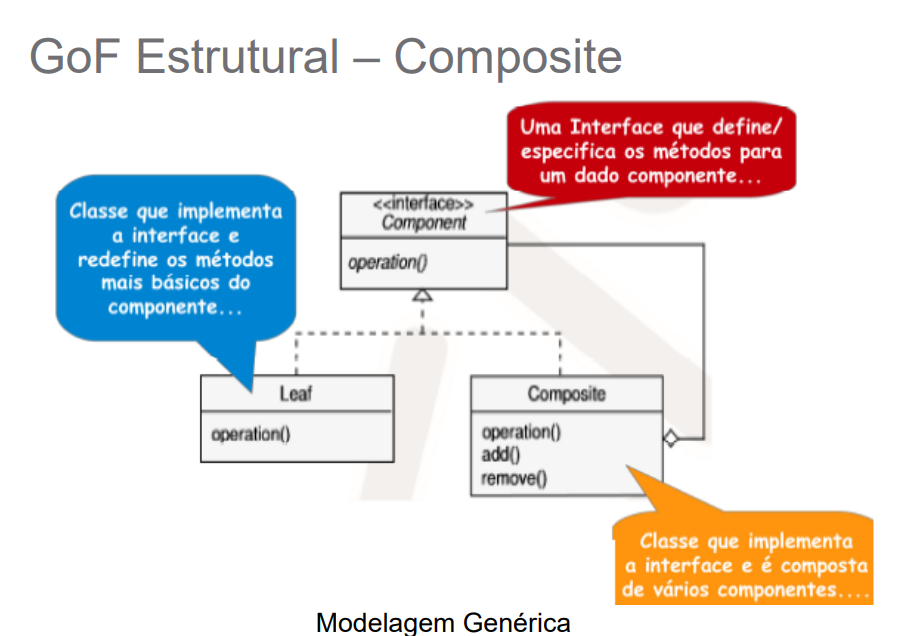
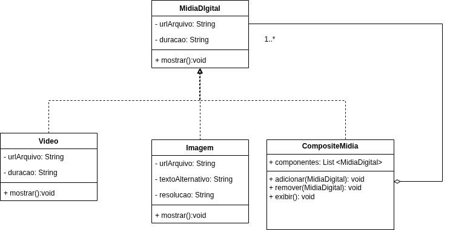
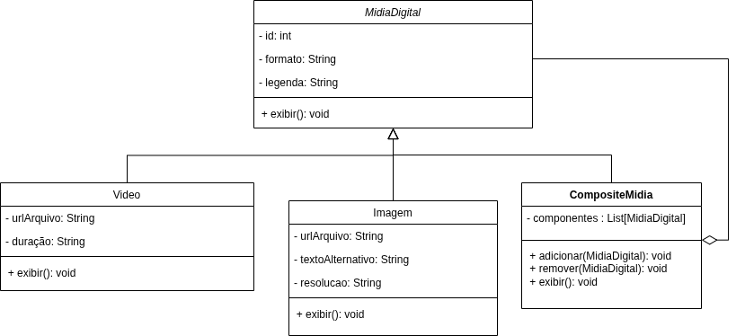
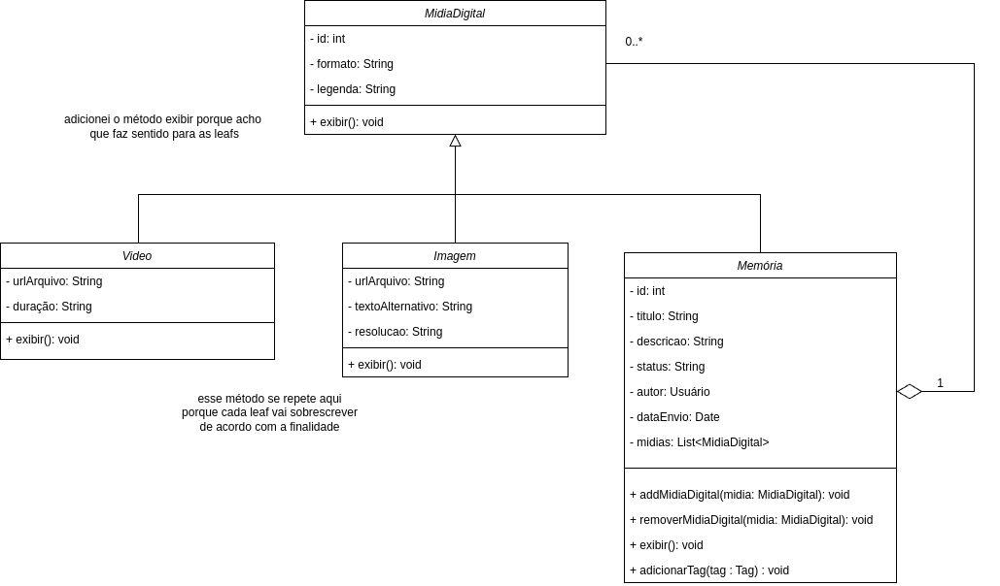

# Composite

## Introdução


## Elementos principais do Composite

## Metodologia


### Contexto


### Motivação da escolha


## Versão Final


## Diagrama


## Interface


## Código

```

    
```


### Versões desenvolvidas individualmente

<details>
<summary>Versão do Marcos Marinho:</summary>

### Marcos

A implementação foi desenvolvida com base no exemplo disponibilizado pela professora no Aprender3, segue o exemplo:
<center>




Autor: Milene Serrano

</center>

### Modelagem

<center>




Autor: [Marcos Vieira Marinho](https://github.com/devMarcosVM)

</center>

### Código

```python
from abc import ABC, abstractmethod
from typing import List

# Classe base abstrata
class MidiaDigital(ABC):
    """
    Classe base abstrata para todos os tipos de mídia digital.
    Conforme o diagrama, assume-se que toda mídia digital tem uma urlArquivo.
    """
    def __init__(self, urlArquivo: str):
        self.urlArquivo = urlArquivo

    @abstractmethod
    def mostrar(self):
        """
        Método abstrato para exibir as informações da mídia.
        As classes filhas devem implementar este método.
        """
        pass

# Classe Imagem (Folha)
class Imagem(MidiaDigital):
    """
    Representa uma mídia digital do tipo Imagem.
    Herda de MidiaDigital e adiciona atributos específicos de imagem.
    """
    def __init__(self, urlArquivo: str, textoAlternativo: str, resolucao: str):
        super().__init__(urlArquivo)
        self.textoAlternativo = textoAlternativo
        self.resolucao = resolucao

    def mostrar(self):
        """Exibe os detalhes da imagem."""
        print(f"[Imagem] URL: {self.urlArquivo}, Texto Alternativo: {self.textoAlternativo}, Resolução: {self.resolucao}")

# Classe Video (Folha)
class Video(MidiaDigital):
    """
    Representa uma mídia digital do tipo Vídeo.
    Herda de MidiaDigital e adiciona atributos específicos de vídeo.
    """
    def __init__(self, urlArquivo: str, duracao: str):
        super().__init__(urlArquivo)
        self.duracao = duracao # Específico para Video

    def mostrar(self):
        """Exibe os detalhes do vídeo."""
        print(f"[Vídeo]  URL: {self.urlArquivo}, Duração: {self.duracao}")

# Classe Composite
class CompositeMidia(MidiaDigital):
    """
    Representa uma coleção de mídias digitais (componentes).
    Pode conter tanto mídias individuais (Imagem, Video) quanto outras coleções (CompositeMidia).
    Herda de MidiaDigital, possuindo uma urlArquivo que pode representar, por exemplo,
    uma miniatura ou ícone para a coleção.
    """
    def __init__(self, titulo: str, urlArquivo_composite: str):
        super().__init__(urlArquivo_composite) # URL para o composite em si (ex: thumbnail da galeria)
        self.titulo = titulo
        self.componentes: List[MidiaDigital] = []

    def adicionar(self, midia: MidiaDigital):
        """Adiciona uma mídia (folha ou outro composite) à coleção."""
        self.componentes.append(midia)
        print(f"Adicionado à composite '{self.titulo}': {type(midia).__name__} (URL: {midia.urlArquivo})")


    def remover(self, midia: MidiaDigital):
        """Remove uma mídia da coleção."""
        try:
            self.componentes.remove(midia)
            print(f"Removido da composite '{self.titulo}': {type(midia).__name__} (URL: {midia.urlArquivo})")
        except ValueError:
            print(f"Erro: Mídia não encontrada na composite '{self.titulo}' para remoção.")


    def mostrar(self):
        """
        Implementação do método abstrato mostrar.
        Exibe informações sobre o próprio composite (metadados da coleção).
        """
        print(f"[Composite] Título: '{self.titulo}', URL Representativa: {self.urlArquivo}")

    def exibir(self):
        """
        Método específico do CompositeMidia (conforme diagrama) para exibir
        as informações de todos os seus componentes.
        """
        print(f"\n--- Conteúdo do Composite '{self.titulo}' ---")
        if not self.componentes:
            print("  (Esta coleção está vazia)")
        for componente in self.componentes:
            componente.mostrar() # Chama o método mostrar de cada componente
        print(f"--- Fim do Composite '{self.titulo}' ---\n")
```
<center>

Autor: [Marcos Vieira Marinho](https://github.com/devMarcosVM)

</center>

</details>


<details>
<summary>Versão do Mateus Henrique: </summary>

### Mateus

A implementação foi desenvolvida com base no exemplo disponibilizado pela professora no Aprender3, adaptando-o para os nossos componentes.  

### Modelagem



<center>

Autor: [Mateus Henrique](https://github.com/Mateushqms)

</center>

### Código

```python
from abc import ABC, abstractmethod
from typing import Optional, List

#Componente base 
class MidiaDigital(ABC):
    def __init__(self, url: str, formato: str, legenda: Optional[str] = None):
        self.url = url
        self.formato = formato
        self.legenda = legenda if legenda else "Mídia sem legenda"
        
    @abstractmethod
    def exibir(self):
        pass

# Folhas
class Video(MidiaDigital):
    def __init__(self, url: str, formato: str, duracao: str, legenda: Optional[str] = None):
        super().__init__(url, formato, legenda)
        self.duracao = duracao

    def exibir(self):
        print(f"Vídeo: {self.url} | Formato: {self.formato} | Duração: {self.duracao} | Legenda: {self.legenda}")

class Imagem(MidiaDigital):
    def __init__(self, url: str, formato: str, resolucao: str, legenda: Optional[str] = None):
        super().__init__(url, formato, legenda)
        self.resolucao = resolucao

    def exibir(self):
        print(f"Imagem: {self.url} | Formato: {self.formato} | Resolução: {self.resolucao} | Legenda: {self.legenda}")

# Composite
class CompositeMidia(MidiaDigital):
    def __init__(self, nome: str):
        super().__init__(url="", formato="colecao", legenda=nome)
        self.componentes: List[MidiaDigital] = []

    def adicionar(self, midia: MidiaDigital):
        self.componentes.append(midia)

    def remover(self, midia: MidiaDigital):
        self.componentes.remove(midia)

    def exibir(self):
        print(f"Coleção: {self.legenda}")
        for componente in self.componentes:
            componente.exibir()

    
```
<center>

Autor: [Mateus Henrique](https://github.com/Mateushqms)

</center>

</details>

<details>
<summary>Versão da Manuella:</summary>

### Manuella

Este projeto implementa o padrão de projeto Composite com o objetivo de facilitar a composição de vários tipos de mídia em uma mesma memória.


### Modelagem


<center>

Autor: [Manuella Magalhães Valadares](https://github.com/manuvaladares)

</center>

### Código

```python
from abc import ABC, abstractmethod
from datetime import date
from typing import List

# Classe base (Componente)
class MidiaDigital(ABC):
    def __init__(self, formato: str, legenda: str):
        self.formato = formato
        self.legenda = legenda

    @abstractmethod
    def exibir(self):
        pass

# Leaf: Vídeo
class Video(MidiaDigital):
    def __init__(self, formato: str, legenda: str, urlArquivo: str, duracao: str):
        super().__init__(formato, legenda)
        self.urlArquivo = urlArquivo
        self.duracao = duracao

    def exibir(self):
        print(f"[Vídeo] URL: {self.urlArquivo}, Duração: {self.duracao}, Legenda: {self.legenda}, Formato: {self.formato}")

# Leaf: Imagem
class Imagem(MidiaDigital):
    def __init__(self, formato: str, legenda: str, urlArquivo: str, textoAlternativo: str, resolucao: str):
        super().__init__(formato, legenda)
        self.urlArquivo = urlArquivo
        self.textoAlternativo = textoAlternativo
        self.resolucao = resolucao

    def exibir(self):
        print(f"[Imagem] URL: {self.urlArquivo}, Resolução: {self.resolucao}, Texto Alt: {self.textoAlternativo}, Legenda: {self.legenda}")

# Composite: Memória
class Memoria:
    def __init__(self, id: int, titulo: str, descricao: str, status: str, autor: str, dataEnvio: date):
        self.id = id
        self.titulo = titulo
        self.descricao = descricao
        self.status = status
        self.autor = autor
        self.dataEnvio = dataEnvio
        self.midias: List[MidiaDigital] = []
        self.tags = []

    def addMidiaDigital(self, midia: MidiaDigital):
        self.midias.append(midia)

    def removerMidiaDigital(self, midia: MidiaDigital):
        self.midias.remove(midia)

    def adicionarTag(self, tag: str):
        self.tags.append(tag)

    def exibir(self):
        print(f"\nMemória: {self.titulo} (ID: {self.id})")
        print(f"Descrição: {self.descricao}, Status: {self.status}, Autor: {self.autor}, Data: {self.dataEnvio}")
        print("Tags:", ", ".join(self.tags))
        print("Mídias associadas:")
        for midia in self.midias:
            midia.exibir()

# Execução exemplo
if __name__ == "__main__":
    video1 = Video("mp4", "Entrevista", "https://exemplo.com/video.mp4", "2min")
    imagem1 = Imagem("jpg", "Foto da reunião", "https://exemplo.com/imagem.jpg", "Reunião com a equipe", "1920x1080")

    memoria = Memoria(1, "Reunião de equipe", "Memória da reunião de planejamento", "finalizada", "Joana", date.today())
    memoria.addMidiaDigital(video1)
    memoria.addMidiaDigital(imagem1)
    memoria.adicionarTag("reunião")
    memoria.adicionarTag("planejamento")
    memoria.exibir()
    
```
<center>

Autor: [Manuella Magalhães Valadares](https://github.com/manuvaladares)

</center>

</details>

<details>
<summary>Versão do William Bernardo: </summary>

### William Bernardo


### Modelagem


<center>

Autor: [William Bernardo](https://github.com/willxbernardo)

</center>

### Código

```python
from abc import ABC, abstractmethod
from typing import List

# Classe base abstrata
class MidiaDigital(ABC):
    def __init__(self, id: int, formato: str, legenda: str):
        self.id = id
        self.formato = formato
        self.legenda = legenda

    @abstractmethod
    def exibir(self):
        pass

# Classe Imagem (Folha)
class Imagem(MidiaDigital):
    def __init__(self, id: int, formato: str, legenda: str, urlArquivo: str, textoAlternativo: str, resolucao: str):
        super().__init__(id, formato, legenda)
        self.urlArquivo = urlArquivo
        self.textoAlternativo = textoAlternativo
        self.resolucao = resolucao

    def exibir(self):
        print(f"[Imagem] ID: {self.id}, Formato: {self.formato}, Legenda: {self.legenda}")
        print(f"         URL: {self.urlArquivo}, Texto Alt: {self.textoAlternativo}, Resolução: {self.resolucao}")

# Classe Video (Folha)
class Video(MidiaDigital):
    def __init__(self, id: int, formato: str, legenda: str, urlArquivo: str, duracao: str):
        super().__init__(id, formato, legenda)
        self.urlArquivo = urlArquivo
        self.duracao = duracao

    def exibir(self):
        print(f"[Vídeo]  ID: {self.id}, Formato: {self.formato}, Legenda: {self.legenda}")
        print(f"         URL: {self.urlArquivo}, Duração: {self.duracao}")

# Classe Composite
class CompositeMedia(MidiaDigital):
    def __init__(self, id: int, formato: str, legenda: str):
        super().__init__(id, formato, legenda)
        self.componentes: List[MidiaDigital] = []

    def adicionar(self, midia: MidiaDigital):
        self.componentes.append(midia)

    def remover(self, midia: MidiaDigital):
        self.componentes.remove(midia)

    def exibir(self):
        print(f"[CompositeMedia] ID: {self.id}, Formato: {self.formato}, Legenda: {self.legenda}")
        print(" Componentes:")
        for componente in self.componentes:
            componente.exibir()

# Execução de exemplo
if __name__ == "__main__":
    # Criando mídias individuais
    imagem1 = Imagem(1, "jpg", "Foto do evento", "https://exemplo.com/img1.jpg", "Imagem de um palco", "1920x1080")
    video1 = Video(2, "mp4", "Vídeo da entrevista", "https://exemplo.com/video1.mp4", "3min")

    # Criando composite
    galeria = CompositeMedia(10, "composto", "Galeria do evento")
    galeria.adicionar(imagem1)
    galeria.adicionar(video1)

    # Criando outro composite dentro do primeiro (exemplo de hierarquia)
    video2 = Video(3, "avi", "Apresentação musical", "https://exemplo.com/video2.avi", "5min")
    subgaleria = CompositeMedia(11, "composto", "Vídeos extras")
    subgaleria.adicionar(video2)

    galeria.adicionar(subgaleria)

    # Exibir todos os conteúdos da galeria
    galeria.exibir()


```
<center>

Autor: [William Bernardo](https://github.com/willxbernardo)

</center>
</details>

## Referências


## Histórico de Versão

| Versão | Data | Descrição | Autor(es) | Revisor(es) | Comentário do Revisor |
| :-: | :-: | :-: | :-: | :-: | :-: |
| `1.0` | 28/05/2025 | Adiciona versão individual do Composite | Manuella | - | - |
| `1.1` | 28/05/2025 | Adiciona versão individual do Composite | Mateus | - | - |
| `1.2` | 29/05/2025 | Adiciona versão individual do Composite | Will | - | - |
