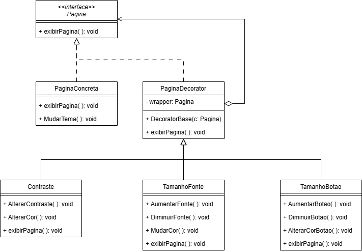
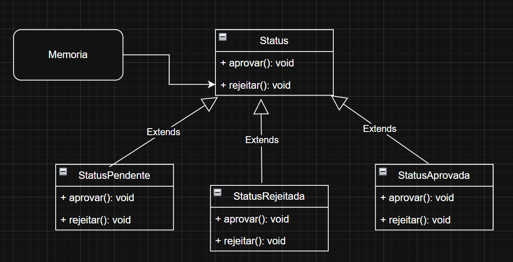

# Decorator

## GoF FINAL


### Versões desenvolvidas

<details>
<summary>Versões desenvolvidas por integrante:</summary>

<details>
<summary>Versão do Gustavo:</summary>

### Gustavo

A implementação foi desenvolvida com base no exemplo disponibilizado pela professora no Aprender3 e, também baseado no site refactoring guru, adaptando-o para os nossos componentes.  

### Modelagem



<center>

Autor: [Gustavo Feitosa Haubert](https://github.com/GustavoHaubert)

</center>

### Código

```python

from abc import ABC, abstractmethod

class Pagina(ABC):
    @abstractmethod
    def exibir_pagina(self):
        pass

class PaginaConcreta(Pagina):
    def exibir_pagina(self):
        return "Exibindo página padrão."

    def mudar_tema(self):
        return "Tema padrão aplicado."

class PaginaDecorator(Pagina):
    def __init__(self, c: Pagina):
        self.wrapper = c

    def exibir_pagina(self):
        return self.wrapper.exibir_pagina()

class Contraste(PaginaDecorator):
    def alterar_contraste(self):
        return "Contraste aumentado."

    def alterar_cor(self):
        return "Cor ajustada para acessibilidade."

    def exibir_pagina(self):
        return f"{self.wrapper.exibir_pagina()} + {self.alterar_contraste()} + {self.alterar_cor()}"

class TamanhoFonte(PaginaDecorator):
    def aumentar_fonte(self):
        return "Fonte aumentada."

    def diminuir_fonte(self):
        return "Fonte diminuída."

    def mudar_cor(self):
        return "Cor da fonte alterada."

    def exibir_pagina(self):
        return f"{self.wrapper.exibir_pagina()} + {self.aumentar_fonte()} + {self.mudar_cor()}"

class TamanhoBotao(PaginaDecorator):
    def aumentar_botao(self):
        return "Botões aumentados."

    def diminuir_botao(self):
        return "Botões diminuídos."

    def alterar_cor_botao(self):
        return "Cor dos botões alterada."

    def exibir_pagina(self):
        return f"{self.wrapper.exibir_pagina()} + {self.aumentar_botao()} + {self.alterar_cor_botao()}"


```

<center>

Autor: [Gustavo Feitosa Haubert](https://github.com/GustavoHaubert)

</center>

</details>

<details>
<summary>Versão da Maria Eduarda:</summary>

## Introdução
Este exemplo é só um modelo de como poderia ser feito!

O padrão **Decorator** (ou Decorador) é um padrão **estrutural** que permite **adicionar funcionalidades a objetos de forma flexível**, sem alterar a estrutura das classes originais. Ele segue o princípio de **abertura/fechamento** do SOLID: aberto para extensão, fechado para modificação.

No contexto de interfaces gráficas e acessibilidade, esse padrão é extremamente útil para permitir que usuários apliquem diferentes **níveis de personalização**, como:

- Alterar tamanho da fonte
- Modificar tamanho dos botões
- Mudar contraste ou cores da interface

## Contexto

Imagine que temos um componente base chamado `Visual`, que representa a aparência padrão do site. Podemos "decorar" esse visual com camadas de customização que o usuário escolhe.

Cada decorador adiciona uma **nova funcionalidade visual**, como aumentar a fonte, trocar cores, ou redimensionar botões, sem precisar reescrever ou estender diretamente o visual original.

## Estrutura de Classes

- `Visual`: classe base (interface ou componente simples).
- `VisualDecorator`: classe abstrata que estende `Visual` e serve de base para os decoradores concretos.
- `FonteGrande`, `BotoesGrandes`, `ContrasteAlto`: decoradores que adicionam customizações específicas.



<center>

Autor: [Maria Eduarda Vieira ](https://github.com/DudaV228)

</center>

### Código
```python

# Classe base
class Visual:
    def renderizar(self):
        return "Site padrão"

# Decorador base
class VisualDecorator(Visual):
    def __init__(self, visual):
        self._visual = visual

    def renderizar(self):
        return self._visual.renderizar()

# Aumentar fonte
class FonteGrande(VisualDecorator):
    def renderizar(self):
        return f"{super().renderizar()} + Fonte Grande"

# Botões maiores
class BotoesGrandes(VisualDecorator):
    def renderizar(self):
        return f"{super().renderizar()} + Botões Grandes"

# Contraste Alto
class ContrasteAlto(VisualDecorator):
    def renderizar(self):
        return f"{super().renderizar()} + Contraste Alto"

#Exemplo de uso
visual_padrao = Visual()
print(visual_padrao.renderizar())  

visual_customizado = ContrasteAlto(FonteGrande(BotoesGrandes(visual_padrao)))
print(visual_customizado.renderizar())


```

<center>

Autor: [Maria Eduarda Vieira ](https://github.com/DudaV228)

</center>

</details>


</details>


## Referências Bibliográficas


## Histórico de Versão

| Versão |  Data  | Descrição | Autor(es) | Revisor(es) | Comentário do Revisor |
| :-: | :-: | :-: | :-: | :-: | :-: |
|   1.0  |  31/05 | adicionando versão individual da implementação do Decorator     | Gustavo |  |  |