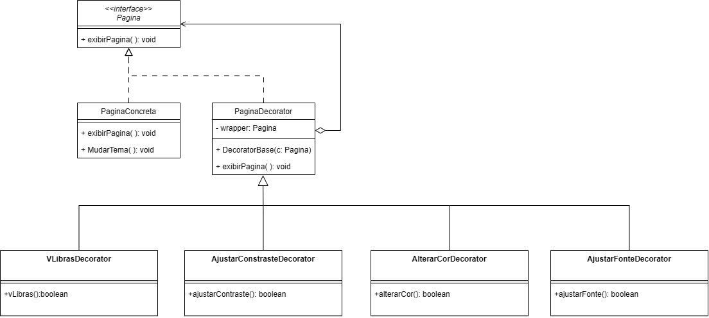
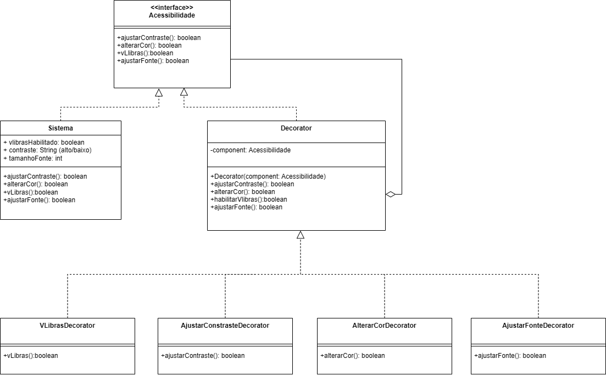
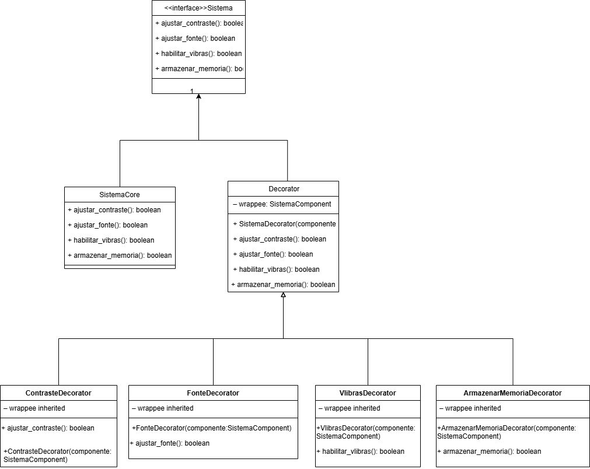

# Decorator

## Introdução  
O padrão de projeto **Decorator** é um dos padrões estruturais mais utilizados em Engenharia de Software. Seu objetivo é permitir que funcionalidades adicionais sejam atribuídas a objetos de maneira flexível e dinâmica, sem modificar sua estrutura original. Isso é feito por meio do encapsulamento de objetos em "decoradores" que implementam a mesma interface ou classe abstrata que o objeto original.

Esse padrão é especialmente útil em cenários onde há necessidade de estender funcionalidades de maneira controlada e combinável, tais como:

- Sistemas de interface gráfica com opções adicionais (como botões com borda, sombra, etc.)  
- Funcionalidades extras em fluxos de dados (como compressão ou criptografia)  
- Aplicações que precisam de diferentes níveis de configuração ou personalização, como no nosso caso, com acessibilidade.

---

## Elementos principais do Decorator  

**Componente**: É a interface ou classe abstrata comum a todos os objetos que podem receber funcionalidades adicionais.  

**Componente Concreto**: É a implementação básica do componente, que pode ser "decorada".  

**Decorator Abstrato**: É uma classe que também implementa a interface do componente e possui uma referência a outro componente (o que será decorado).  

**Decoradores Concretos**: São classes que herdam do decorator abstrato e implementam funcionalidades adicionais, estendendo o comportamento do componente decorado.

---

## Metodologia  
O desenvolvimento desta seção do trabalho também foi dividido entre os integrantes (**Edilson**, **Gustavo**, **Maria Eduarda** e **Marcus**), onde cada um ficou responsável por entender o padrão Decorator e propor um exemplo prático de aplicação. Durante nossas reuniões, apresentamos as ideias individualmente e discutimos diferentes maneiras de aplicar o padrão no nosso sistema. A partir disso, consolidamos as contribuições de todos em uma solução final que combinasse clareza, eficiência e aderência ao padrão proposto.

---

## Contexto  
Aplicamos o padrão Decorator no contexto do sistema de acessibilidade, utilizando uma classe `PaginaConcreta` como componente base. Essa classe oferece funcionalidades básicas, como alterar contraste, habilitar Libras e ajustar o tamanho da fonte. 

Por meio do padrão Decorator, conseguimos adicionar essas funcionalidades de forma modular, criando decoradores como `VLibrasDecorator`, `AjustarContrasteDecorator`, `AlterarCorDecorator` e `AjustarFonteDecorator`, cada um responsável por uma funcionalidade específica. Isso nos permitiu montar diferentes configurações de acessibilidade combinando os decoradores, sem alterar a implementação da classe `Sistema`.

---

## Motivação da escolha  
O padrão Decorator foi escolhido por sua capacidade de adicionar funcionalidades de forma flexível e escalável, sem comprometer o encapsulamento ou exigir alterações diretas nas classes originais. Em nosso sistema, o Decorator se mostrou ideal para lidar com as múltiplas opções de acessibilidade que podem ser habilitadas de forma independente. 

Dessa forma, conseguimos aplicar o **princípio da responsabilidade única**, mantendo cada funcionalidade separada em seu respectivo decorador. Além disso, o padrão nos forneceu uma maneira elegante de combinar e organizar comportamentos sem recorrer a heranças rígidas ou estruturas complexas. Isso tornou o sistema mais coeso, reutilizável e de fácil manutenção.


## GoF FINAL



### Versões desenvolvidas

### Código

```python

from abc import ABC, abstractmethod

class Pagina(ABC):
    @abstractmethod
    def exibir_pagina(self):
        pass

class PaginaConcreta(Pagina):
    def exibir_pagina(self):
        return "Exibindo página padrão."

    def mudar_tema(self):
        return "Tema padrão aplicado."

class PaginaDecorator(Pagina):
    def __init__(self, c: Pagina):
        self.wrapper = c

    def exibir_pagina(self):
        return self.wrapper.exibir_pagina()

class Contraste(PaginaDecorator):
    def alterar_contraste(self):
        return "Contraste aumentado."

    def alterar_cor(self):
        return "Cor ajustada para acessibilidade."

    def exibir_pagina(self):
        return f"{self.wrapper.exibir_pagina()} + {self.alterar_contraste()} + {self.alterar_cor()}"

class TamanhoFonte(PaginaDecorator):
    def aumentar_fonte(self):
        return "Fonte aumentada."

    def diminuir_fonte(self):
        return "Fonte diminuída."

    def mudar_cor(self):
        return "Cor da fonte alterada."

    def exibir_pagina(self):
        return f"{self.wrapper.exibir_pagina()} + {self.aumentar_fonte()} + {self.mudar_cor()}"

class TamanhoBotao(PaginaDecorator):
    def aumentar_botao(self):
        return "Botões aumentados."

    def diminuir_botao(self):
        return "Botões diminuídos."

    def alterar_cor_botao(self):
        return "Cor dos botões alterada."

    def exibir_pagina(self):
        return f"{self.wrapper.exibir_pagina()} + {self.aumentar_botao()} + {self.alterar_cor_botao()}"


```

<details>
<summary>Versões desenvolvidas por integrante:</summary>

<details>
<summary>Versão do Gustavo:</summary>

### Gustavo

A implementação foi desenvolvida com base no exemplo disponibilizado pela professora no Aprender3 e, também baseado no site refactoring guru, adaptando-o para os nossos componentes.

### Modelagem


<center>

Autor: [Gustavo Feitosa Haubert](https://github.com/GustavoHaubert)

</center>

### Código

```python

from abc import ABC, abstractmethod

class Pagina(ABC):
    @abstractmethod
    def exibir_pagina(self):
        pass

class PaginaConcreta(Pagina):
    def exibir_pagina(self):
        return "Exibindo página padrão."

    def mudar_tema(self):
        return "Tema padrão aplicado."

class PaginaDecorator(Pagina):
    def __init__(self, c: Pagina):
        self.wrapper = c

    def exibir_pagina(self):
        return self.wrapper.exibir_pagina()

class AjustarContrasteDecorator(PaginaDecorator):
    def alterar_contraste(self):
        return "Contraste aumentado."

    def alterar_cor(self):
        return "Cor ajustada para acessibilidade."

    def exibir_pagina(self):
        return f"{self.wrapper.exibir_pagina()} + {self.alterar_contraste()} + {self.alterar_cor()}"

class AjustarFonteDecorator(PaginaDecorator):
    def aumentar_fonte(self):
        return "Fonte aumentada."

    def diminuir_fonte(self):
        return "Fonte diminuída."

    def mudar_cor(self):
        return "Cor da fonte alterada."

    def exibir_pagina(self):
        return f"{self.wrapper.exibir_pagina()} + {self.aumentar_fonte()} + {self.mudar_cor()}"

class VLibrasDecorator(PaginaDecorator):
    def abilitarVlibtas(self):
        self.vibras_habilitado = True
        return "Libras habilitado"
    def desabilitarVlibtas(self):
        self.vibras_habilitado = False
        return "Libras desabilitado"

class AlterarCorDecorator(PaginaDecorator):
    def temaClaro(self):
        self.theme = "Light"
        return "Tema claro habilitado"
    def temaEscuro(self):
        self.theme = "Dark"
        return "Tema escuro habilitado"
    def modoDaltonico(self):
        self.theme = "ColorBlind"
        return "Modo daltônico habilitado"

```

<center>

Autor: [Gustavo Feitosa Haubert](https://github.com/GustavoHaubert)

</center>

</details>

<details>
<summary>Versão do Marcus:</summary>

### Marcus Escobar

### Modelagem



<center>

Autor: [Marcus Escobar](https://github.com/MarcusEscobar)

</center>

### Código

```python

from abc import ABC, abstractmethod

class Acessibilidade(ABC): #interface Acessibilidade
    @abstractmethod
    def ajustar_contraste(self) -> bool:
        pass

    @abstractmethod
    def alterar_cor(self) -> bool:
        pass

    @abstractmethod
    def v_libras(self) -> bool:
        pass

    @abstractmethod
    def ajustar_fonte(self) -> bool:
        pass

#Comportamento Base
class Sistema(Acessibilidade):
    def __init__(self):
        self.vibras_habilitado = False
        self.contraste = "baixo"
        self.tamanho_fonte = 12

    def ajustar_contraste(self) -> bool:
        self.contraste = "alto"
        print("Contraste ajustado para alto")
        return True

    def alterar_cor(self) -> bool:
        print("Cores alteradas para modo acessível")
        return True

    def v_libras(self) -> bool:
        self.vibras_habilitado = True
        print("Libras habilitado")
        return True

    def ajustar_fonte(self) -> bool:
        self.tamanho_fonte += 2
        print(f"Tamanho da fonte ajustado para {self.tamanho_fonte}")
        return True

#Decorator
class Decorator(Acessibilidade):
    def __init__(self, component: Acessibilidade):
        self.component = component

    def ajustar_contraste(self) -> bool:
        return self.component.ajustar_contraste()

    def alterar_cor(self) -> bool:
        return self.component.alterar_cor()

    def v_libras(self) -> bool:
        return self.component.v_libras()

    def ajustar_fonte(self) -> bool:
        return self.component.ajustar_fonte()

```

<center>

Autor: [Marcus Escobar](https://github.com/MarcusEscobar)

</center>

</details>

<details>
<summary>Versão da Maria Eduarda:</summary>

## Introdução

Este exemplo é só um modelo de como poderia ser feito!

O padrão **Decorator** (ou Decorador) é um padrão **estrutural** que permite **adicionar funcionalidades a objetos de forma flexível**, sem alterar a estrutura das classes originais. Ele segue o princípio de **abertura/fechamento** do SOLID: aberto para extensão, fechado para modificação.

No contexto de interfaces gráficas e acessibilidade, esse padrão é extremamente útil para permitir que usuários apliquem diferentes **níveis de personalização**, como:

- Alterar tamanho da fonte
- Modificar tamanho dos botões
- Mudar contraste ou cores da interface

## Contexto

Imagine que temos um componente base chamado `Visual`, que representa a aparência padrão do site. Podemos "decorar" esse visual com camadas de customização que o usuário escolhe.

Cada decorador adiciona uma **nova funcionalidade visual**, como aumentar a fonte, trocar cores, ou redimensionar botões, sem precisar reescrever ou estender diretamente o visual original.

## Estrutura de Classes

- `Visual`: classe base (interface ou componente simples).
- `VisualDecorator`: classe abstrata que estende `Visual` e serve de base para os decoradores concretos.
- `FonteGrande`, `BotoesGrandes`, `ContrasteAlto`: decoradores que adicionam customizações específicas.


<center>

Autor: [Maria Eduarda Vieira ](https://github.com/DudaV228)

</center>

### Código

```python

# Classe base
class Visual:
    def renderizar(self):
        return "Site padrão"

# Decorador base
class VisualDecorator(Visual):
    def __init__(self, visual):
        self._visual = visual

    def renderizar(self):
        return self._visual.renderizar()

# Aumentar fonte
class FonteGrande(VisualDecorator):
    def renderizar(self):
        return f"{super().renderizar()} + Fonte Grande"

# Botões maiores
class BotoesGrandes(VisualDecorator):
    def renderizar(self):
        return f"{super().renderizar()} + Botões Grandes"

# Contraste Alto
class ContrasteAlto(VisualDecorator):
    def renderizar(self):
        return f"{super().renderizar()} + Contraste Alto"

#Exemplo de uso
visual_padrao = Visual()
print(visual_padrao.renderizar())

visual_customizado = ContrasteAlto(FonteGrande(BotoesGrandes(visual_padrao)))
print(visual_customizado.renderizar())

```

<center>

Autor: [Maria Eduarda Vieira ](https://github.com/DudaV228)

</center>
</details>

<details>
<summary>Versão do Edilson:</summary>

### Edilson

### Modelagem



<center>

Autor: [Edilson Ribeiro](https://github.com/edilson-r-jr)

</center>

### Código

```python

from abc import ABC, abstractmethod

# 1) Interface / Componente
class SistemaComponent(ABC):
    @abstractmethod
    def ajustar_contraste(self) -> bool:
        pass

    @abstractmethod
    def ajustar_fonte(self) -> bool:
        pass

    @abstractmethod
    def habilitar_vibras(self) -> bool:
        pass

    @abstractmethod
    def armazenar_memoria(self) -> bool:
        pass


# 2) Implementação “core” do Sistema
class SistemaCore(SistemaComponent):
    def ajustar_contraste(self) -> bool:
        print("[SistemaCore] Contraste ajustado (configuração padrão).")
        return True

    def ajustar_fonte(self) -> bool:
        print("[SistemaCore] Fonte ajustada (configuração padrão).")
        return True

    def habilitar_vibras(self) -> bool:
        print("[SistemaCore] Vibração habilitada (configuração padrão).")
        return True

    def armazenar_memoria(self) -> bool:
        print("[SistemaCore] Memória armazenada (configuração padrão).")
        return True


# 3) Decorator abstrato
class SistemaDecorator(SistemaComponent):
    def __init__(self, componente: SistemaComponent):
        self._wrappee = componente

    def ajustar_contraste(self) -> bool:
        return self._wrappee.ajustar_contraste()

    def ajustar_fonte(self) -> bool:
        return self._wrappee.ajustar_fonte()

    def habilitar_vibras(self) -> bool:
        return self._wrappee.habilitar_vibras()

    def armazenar_memoria(self) -> bool:
        return self._wrappee.armazenar_memoria()


# 4) Decorators concretos

class ContrasteDecorator(SistemaDecorator):
    def __init__(self, componente: SistemaComponent):
        super().__init__(componente)

    def ajustar_contraste(self) -> bool:
        print("[ContrasteDecorator] Pré-processamento de contraste.")
        resultado = super().ajustar_contraste()
        print("[ContrasteDecorator] Pós-processamento de contraste.")
        return resultado


class FonteDecorator(SistemaDecorator):
    def __init__(self, componente: SistemaComponent):
        super().__init__(componente)

    def ajustar_fonte(self) -> bool:
        print("[FonteDecorator] Pré-processamento de fonte.")
        resultado = super().ajustar_fonte()
        print("[FonteDecorator] Pós-processamento de fonte.")
        return resultado


class VibrasDecorator(SistemaDecorator):
    def __init__(self, componente: SistemaComponent):
        super().__init__(componente)

    def habilitar_vibras(self) -> bool:
        print("[VlibrasDecorator] Pré-processamento de vibração.")
        resultado = super().habilitar_vibras()
        print("[VlibrasDecorator] Pós-processamento de vibração.")
        return resultado


class ArmazenarMemoriaDecorator(SistemaDecorator):
    def __init__(self, componente: SistemaComponent):
        super().__init__(componente)

    def armazenar_memoria(self) -> bool:
        print("[ArmazenarMemoriaDecorator] Pré-processamento de armazenamento.")
        resultado = super().armazenar_memoria()
        print("[ArmazenarMemoriaDecorator] Pós-processamento de armazenamento.")
        return resultado

```

</details>

</details>

## Referências Bibliográficas

## Histórico de Versão

| Versão | Data  |                          Descrição                          |    Autor(es)    | Revisor(es) | Comentário do Revisor |
| :----: | :---: | :---------------------------------------------------------: | :-------------: | :---------: | :-------------------: |
|  1.0   | 31/05 | adicionando versão individual da implementação do Decorator |     Gustavo     |             |                       |
|  1.1   | 01/06 | adicionando versão individual da implementação do Decorator |  Maria Eduarda  |             |                       |
|  1.2   | 01/06 | adicionando versão individual da implementação do Decorator | Marcus Escobar  |             |                       |
|  1.3   | 01/06 | adicionando versão individual da implementação do Decorator | Edilson Ribeiro |             |                       |
|  1.4   | 01/06 | adicionando versão Final da implementação do Decorator | Marcus Escobar |             |                       |
