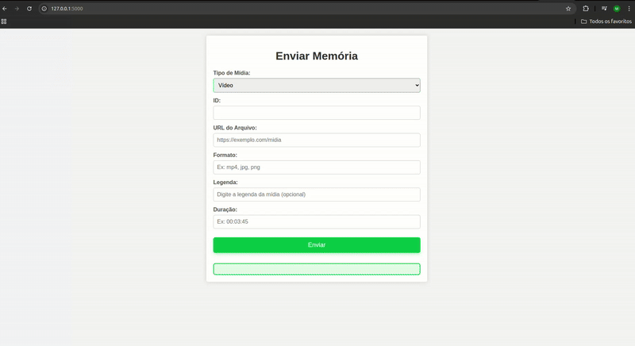

# Eterna FGA

**Código da Disciplina**: FGA0208 
**Número do Grupo**: 02 
**Entrega**: 03 

## Alunos

| Matrícula | Aluno                                   | Github |
| :-: | :-: | :-: |
| 222014975 | Cairo Florenço Santos                   | [CA1RO](https://github.com/CA1RO) |
| 222024461 | Edilson Ribeiro da Cruz Júnior          | [edilson-r-jr](https://github.com/edilson-r-jr)|
| 221008356 | Maria Eduarda Vieira Monteiro           | [DudaV228](https://github.com/DudaV228) |
| 222015112 | Gabriel Reis Scheidt Paulino            | [Gxaite](https://github.com/Gxaite)|
| 222024793 | Gustavo Feitosa Haubert                 | [GustavoHaubert](https://github.com/GustavoHaubert)|
| 222021890 | Manuella Magalhães Valadares            | [manuvaladares](https://github.com/manuvaladares)|
| 222021906 | Marcos Vieira Marinho                   | [devMarcosVM](https://github.com/devMarcosVM)|
| 222006973 | Marcus Vinícius Figuerêdo Escobar       | [MarcusEscobar](https://github.com/MarcusEscobar)|
| 222025950 | Mateus Henrique Queiroz Magalhães Sousa | [Mateushqms](https://github.com/Mateushqms)|
| 222026386 | Pedro Gois Marques Monteiro             | [Goizzz](https://github.com/Goizzz)|
| 222021933 | William Bernardo da Silva               | [WillxBernardo](https://github.com/willxbernardo)|

## Sobre

A Eterna FGA é um museu afetivo virtual, uma aplicação web criada para eternizar as memórias da comunidade acadêmica. Nele, qualquer pessoa da comunidade pode enviar suas imagens, compartilhar suas histórias e conhecer um pouco mais sobre as pessoas que fazem parte do cotidiano da faculdade.

## Screenshots da Terceira Entrega

## Há algo a ser executado?

( ) SIM

(X) NÃO

## Histórico de Versão

| Versão | Data | Descrição | Autor(es) | Revisor(es) | Comentário do Revisor |
| :-: | :-: | :-: | :-: | :-: | :-: |
| `1.0` | 19/05/2025  | Versão inicial do README. | Cairo | | |

